# Deep Research Prompt — MegaCampusAI Integration & Infrastructure v2.1.0

**Version**: 2.1.0
**Release Date**: 2025-11-06
**Breaking Changes Since**: v1.0.0 (Multi-jurisdictional architecture required)
**Dependencies**: External research tools, MegaCampusAI repository access, MSK timezone
**Compatibility**: Replaces all v1.x and v2.0.x versions

Execute comprehensive, evidence-backed research comparing three MegaCampusAI delivery scenarios with audit-ready consolidated outputs. Prioritize commercial objective of maximizing 3-month subscription conversions at March 2026 Dubai summit (2000 education professionals) while ensuring regulatory compliance for Russia-Dubai-global expansion architecture.

**CRITICAL DEPLOYMENT CONTEXT**: March 2026 launch uses Russian hosting for Russian clientele, Dubai hosting for all other markets. Post-launch US/EU expansion planned. Investor acknowledges compliance risks while requiring comprehensive risk documentation for informed decision-making.

**EXECUTION REQUIREMENTS**: This execution must integrate external compliance research with canonical repository sources. Follow MegaCampusAI repository structure and REPORT-TEMPLATE-STANDARD.md. Mandatory MSK timezone. NO archive directories. Enforce rich formatting with tables, diagrams, and visual elements for readability.

---

## Mandatory External Research Phase (CRITICAL - Execute First)

**BEFORE analyzing canonical sources**, execute comprehensive external research using available tools:

### **Required Compliance Standards Research**

Execute web searches and document findings for:

#### **Multi-Jurisdictional Privacy Framework**

- **GDPR (EU)**: Data minimization, consent mechanisms, right to erasure, cross-border transfer requirements
- **UK GDPR + Data Protection Act 2018**: Post-Brexit adequacy framework, UK IDTA requirements
- **CCPA/CPRA (California)**: Consumer rights, opt-out mechanisms, sensitive PI limitations
- **PIPEDA (Canada)**: Cross-border data transfer requirements, consent frameworks

#### **Russian Federation Requirements (HIGHEST PRIORITY)**

- **Federal Law 152-FZ (2025 amendments)**: Complete data localization, enhanced penalties (18M RUB)
- **Sovereign Internet Law (RuNet)**: Deep packet inspection, traffic control, infrastructure mapping
- **Foreign Agent Law (2025)**: Single violation prosecution, operational restrictions, international partnership risks
- **GOST R Cryptographic Standards**: Mandatory Russian crypto requirements, FSB compliance

#### **Dubai/UAE Regulatory Framework**

- **UAE Data Protection Law**: Cross-border transfer requirements, localization obligations
- **Dubai International Financial Centre (DIFC) Data Protection Law**: Financial services compliance
- **UAE Cybersecurity Law**: Incident reporting, security controls, government access requirements

#### **Education-Specific Regulations**

- **FERPA (US Federal)**: Student record privacy, parental consent, educational disclosures
- **COPPA (US Federal)**: Children under 13 privacy protection, verifiable parental consent

#### **Security and Audit Frameworks**

- **SOC2 Type II**: Security controls, availability, processing integrity, confidentiality
- **ISO 27001**: ISMS implementation, risk assessment, security controls (Annex A)
- **NIST CSF 2.0**: Identify, Protect, Detect, Respond, Recover functions
- **PCI DSS**: Payment card data protection for subscription processing

#### **Cross-Border Data Transfer Framework**

- **EU Data Governance Act (2024)**: Data sovereignty, cross-border intermediary requirements
- **EU Data Act (2025)**: Third-country government access restrictions, cloud provider obligations  
- **Standard Contractual Clauses 2021**: Data Transfer Impact Assessments, supplementary measures
- **Schrems II implications**: Adequacy assessments, government surveillance evaluation

### **External Research Integration Requirements**

- Mark all external findings as **EXTERNAL-STANDARD*- with authoritative source URLs
- Create separate multi-jurisdictional compliance matrix before scenario analysis
- Map external standards to canonical source capabilities and identify gaps
- Flag regulatory conflicts between jurisdictions (Russia vs EU/US requirements)

---

## Execution Framework & File Organization (Strict Requirements)

### **Repository Structure Integration (CRITICAL)**

**Base Pattern**: `docs/reports/{category}/{YYYY-MM}/YYYY-MM-DD-HHMM-MSK-{type}.md`

1. **Main Analysis**: `docs/reports/integration/2025-11/YYYY-MM-DD-HHMM-MSK-consolidated-report.md`
2. **Persona Analysis**: `docs/reports/integration/2025-11/YYYY-MM-DD-HHMM-MSK-persona-reports.md`
3. **Compliance Matrix**: `docs/reports/compliance/2025-11/YYYY-MM-DD-HHMM-MSK-compliance-analysis.md`
4. **Technical Validation**: `docs/reports/security/2025-11/YYYY-MM-DD-HHMM-MSK-technical-validation.md`
5. **Evidence Index**: `docs/reports/integration/2025-11/YYYY-MM-DD-HHMM-MSK-evidence-index.md`
6. **Risk Assessment**: `docs/reports/security/2025-11/YYYY-MM-DD-HHMM-MSK-risk-register.md`
7. **Source Validation**: `docs/reports/integration/2025-11/YYYY-MM-DD-HHMM-MSK-canonical-validation.md`

### **Required YAML Frontmatter (All Artifacts)**

```yaml
report_type: integration-analysis | compliance-analysis | risk-assessment | technical-validation | evidence-index | persona-analysis | canonical-validation
generated: YYYY-MM-DDTHH:mm:ss+03:00 # MSK timezone ISO format
version: YYYY-MM-DD
status: success | partial | failed
agent: integration-research-agent
duration: execution_time_string
jurisdictions_analyzed: ["Russia", "UAE", "EU", "US", "Canada"]
scenarios_evaluated: 3
compliance_frameworks: ["GDPR", "152-FZ", "UAE-PDPL", "SOC2", "ISO27001", "NIST-CSF", "PCI-DSS"]
repository_integration: true
```

### **Repository Standards Compliance**

- **Follow REPORT-TEMPLATE-STANDARD.md**: All reports must comply with existing agent ecosystem standards
- **ADR Integration**: Create ADR-002 for scenario selection following ADR-001 format
- **Phase Documentation**: Document implementation in `docs/phases/` structure
- **Cross-Reference Integration**: Link to `docs/ARCHITECTURE-DIAGRAM.md`, `docs/IMPLEMENTATION_ROADMAP_EN.md`

---

## Presentation & Visuals Policy (Mandatory)

### **Rich Formatting Requirements**

#### **Tables (Mandatory for All Comparisons)**

- **Scenario Comparison**: Any "A vs B vs C" content must use Markdown tables
- **Maximum 8 columns**: Time-to-MVP | Cost | Risk | Regulatory-fit | Global-scalability | Team-fit | Integration-complexity | Evidence-anchors
- **Persona Rollup Table**: Aggregate all 20 persona scores by scenario in single table
- **Compliance Matrix Table**: Multi-jurisdictional regulatory requirements comparison
- **Technical Validation Table**: Test vectors, expected results, evidence citations

#### **Visual Elements (Required)**

- **Collapsible Table of Contents**: Add to top of all artifacts >2000 words

    ```markdown
    <details> <summary>Table of Contents</summary>
    - [Executive Summary](#executive-summary)
    - [Multi-Jurisdictional Compliance Matrix](#multi-jurisdictional-compliance-matrix)
    - [Scenario Analysis](#scenario-analysis)
    - [Risk Assessment](#risk-assessment)
    - [Technical Validation](#technical-validation)
    - [Recommendations](#recommendations)
    </details>
    ```

- **Mermaid Diagrams**: Minimum one per artifact where flows/architecture exist
  - Russia-Dubai Architecture Split:

    ```mermaid
    flowchart LR
    RU[🇷🇺 Russia Region<br/>GOST R crypto<br/>152-FZ storage] -->|JWT region_code| API[API Gateway<br/>tRPC over HTTP]
    AE[🇦🇪 Dubai Region<br/>UAE PDPL<br/>Global users] -->|Residency checks| API
    API -->|Multi-tenant routing| SVC[Orchestrator<br/>BullMQ]
    SVC --> DB[(Supabase PostgreSQL<br/>RLS by region)]
    DB -. RLS: region=RU .- RU
    DB -. RLS: region=AE .- AE
    ```

  - Cross-Border Data Flow with Compliance Checkpoints:

    ```mermaid
    flowchart TD
    EU[EU User Request] --> TIA{Transfer Impact<br/>Assessment}
    TIA -->|Adequate| SCC[Standard Contractual<br/>Clauses 2021]
    TIA -->|Inadequate| BLOCK[❌ Transfer Blocked]
    SCC --> AE[🇦🇪 Dubai Processing]
    RU[🇷🇺 Russian User] --> LOC[152-FZ Localization<br/>Check]
    LOC -->|Compliant| RUDB[(Russian Database)]
    LOC -->|Violation| FINE[18M RUB Fine Risk]
    ```

- **Risk Heatmap (ASCII Matrix)**:

    ```markdown
    Risk Assessment Matrix (Probability × Impact)

        Impact →
        Low    Medium   High
    P Hi   🟨      🟥       🟥
    r Med  🟩      🟨       🟥  
    o Low  🟩      🟩       🟨

    🟩 = Low Risk    🟨 = Medium Risk    🟥 = High Risk
    ```

### **Emoji Usage Guidelines (Purposeful Only)**

- Status Indicators: ✅ (pass/complete), ⚠️ (warning/partial), ❌ (fail/critical)  
- Priority Levels: 🟩 (low), 🟨 (medium), 🟥 (high)  
- Time Sensitivity: ⏱️ (deadline), 💸 (cost impact)  
- Jurisdictions: 🇷🇺 🇦🇪 🇪🇺 🇺🇸 (only in diagrams/headers)  
- NO decorative emojis: Avoid 🎯 🚀 💡 ⭐ or similar decorative elements  
- Maximum: One emoji per bullet point or table cell

### **Callout Blocks (Key Decisions)**

```markdown
!!! CRITICAL DECISION
Scenario B (AI Team Infrastructure) selected for Russia-Dubai split deployment 
due to enforceable data residency and comprehensive audit capabilities.
```

### Code Blocks (Test Vectors)

```markdown
# Test: Russian Data Localization Enforcement
curl -H "Authorization: Bearer ${RU_TOKEN}" \
     -H "Content-Type: application/json" \
     ${API_URL}/data/export

# Expected Output:
# HTTP 200 OK
# {"status": "success", "region": "RU", "compliance": "152-FZ"}
# Data remains in Russian infrastructure only
```

---

## **Ready-to-Use Table Templates (Mandatory Implementation)**

### **Scenario Comparison Table (Consolidated Report)**

```markdown
| Scenario | Time-to-MVP | Cost | Risk | Regulatory-fit | Global-scalability | Team-fit | Integration-complexity | Key Evidence |
|---|---:|---:|---:|---:|---:|---:|---:|---|
| A: Guided Integration | 3/5 | 2/5 | 4/5 | 2/5 | 3/5 | 2/5 | 4/5 | [docs/API.md:150-197] |
| B: AI Team Infrastructure | 4/5 | 3/5 | 2/5 | 4/5 | 4/5 | 4/5 | 2/5 | [docs/SUPABASE-DATABASE-REFERENCE.md:25-41] |
| C: OSS Integration | 4/5 | 3/5 | 3/5 | 3/5 | 4/5 | 3/5 | 3/5 | EXTERNAL-STANDARD (Moodle/Canvas) |

**Legend**: 1=Poor, 2=Below Average, 3=Adequate, 4=Good, 5=Excellent
```

### Persona Rollup Table (Persona Reports)

```markdown
| Persona | Scenario A | Scenario B | Scenario C | RU Confidence | AE Confidence | EU Confidence | US Confidence |
|---|---:|---:|---:|---|---|---|---|
| CTO/Project Lead | 2.8/5 | 4.2/5 | 3.5/5 | High | High | Medium | Low |
| Product Manager | 3.1/5 | 4.0/5 | 3.8/5 | Medium | High | Medium | Medium |
| Russian Compliance Specialist | 2.0/5 | 4.5/5 | 3.2/5 | High | Medium | Low | Low |
| GDPR/EU Compliance Auditor | 3.5/5 | 3.8/5 | 4.2/5 | Low | Medium | High | High |
| UAE/Dubai Regulatory Specialist | 3.2/5 | 4.1/5 | 3.6/5 | Medium | High | Medium | Medium |
| ... (all 20 personas) | ... | ... | ... | ... | ... | ... | ... |

**Average Scores**: A: 2.9/5 | B: 4.1/5 | C: 3.6/5
```

### Multi-Jurisdictional Compliance Matrix (Compliance Analysis)

```markdown
| Jurisdiction | Data Residency Requirement | Cross-Border Transfer Mechanism | Security Standards | Audit Requirements | Education/Child Rules |
|---|---|---|---|---|---|
| 🇷🇺 Russia | 152-FZ: RU-only storage mandatory | Restricted; government access required | GOST R; RuNet DPI compliance | State inspections; 18M RUB fines | No special child protections |
| 🇦🇪 UAE/DIFC | UAE PDPL: Local preference | Adequacy/contractual safeguards | Cybersecurity Law compliance | Breach notification <72h | Limited framework |
| 🇪🇺 EU | GDPR: Adequacy or safeguards | SCC 2021 + Transfer Impact Assessment | ISO 27001/SOC2 aligned | DPO; processing records | Strong child protections |
| 🇺🇸 US | No general requirement | Commercial adequacy frameworks | NIST CSF; SOC2 Type II | Sectoral (FERPA/COPPA) | FERPA (education); COPPA (<13) |
| 🇨🇦 Canada | PIPEDA: Cross-border restrictions | Adequacy or contractual | ISO 27001 aligned | Privacy Commissioner | Similar to EU framework |

**Sources**: All cells anchored to EXTERNAL-STANDARD URLs in Evidence Index
```

### Technical Validation Results Table (Technical Validation)

```markdown
| Control Area | Validation Check | Test Vector | Expected Result | Actual Result | Evidence Citation |
|---|---|---|---|---|---|
| Russian Data Residency | Export restriction test | `curl .../export` with RU token | Data export allowed, logged locally | ✅ PASS | [docs/API.md:150-197] |
| Cross-Border Blocking | EU→RU data access attempt | `curl .../access` with region=RU | 403 Forbidden + compliance log | ✅ PASS | [docs/SUPABASE-DATABASE-REFERENCE.md:25-41] |
| GOST R Cryptography | Cipher suite validation | `openssl ciphers` on RU deployment | GOST algorithms present | ⚠️ PARTIAL | EXTERNAL-STANDARD (GOST spec) |
| UAE PDPL Breach Response | Incident response drill | Tabletop simulation | <72h notification workflow | ❌ NOT TESTED | EXTERNAL-STANDARD (UAE PDPL) |
| JWT Region Claims | Token validation | `jwt decode` RU user token | `region_code: "RU"` present | ✅ PASS | [docs/API.md:137-146] |
```

### Risk Assessment Matrix (Risk Register)

```markdown
| Risk ID | Description | Probability | Impact | Overall | Jurisdiction | Mitigation Strategy | Owner |
|---|---|---|---|---|---|---|---|
| RU-01 | 152-FZ violation: data leaves Russia | Medium | High | 🟥 | Russia | Enforce region-aware RLS policies | DevOps Team |
| AE-02 | UAE PDPL breach notification failure | Low | High | 🟨 | UAE/Dubai | Implement automated breach workflows | Compliance Team |
| EU-03 | Schrems II adequacy challenge | High | Medium | 🟥 | EU (future) | Deploy EU region; implement SCCs 2021 | Legal Team |
| US-04 | COPPA violation for child users | Medium | High | 🟥 | US (future) | Age verification + parental consent | Product Team |
| COM-05 | Foreign agent designation risk | High | High | 🟥 | Russia | Structure AI Team as domestic entity | Legal Team |
```

---

## **Stakeholder Context (Critical Business Intelligence)**

### **AI Team (Primary Execution Team \- Russian-based)**

- CTO (Moscow-based): Technical leadership, cross-team coordination, multi-jurisdictional compliance oversight  
- PM: Commercial objectives, Dubai summit preparation, subscription conversion optimization  
- AI Dev Lead (Игорь Масленников): CourseAI original author, vibe-coding methodology, agent-first development  
- Team profile: Russian startup, growing AI/ML expertise, Agile methodology, part-time economics  
- Priorities: Enterprise-ready solution with Russian compliance, Dubai launch readiness, global expansion capability  
- Constraints: Resource limitations, multi-jurisdictional legal complexity, foreign agent designation risks

### **LMS Team (Reluctant Integration Partner)**

- Composition: Backend/frontend developers maintaining MegaCampus (2022-established)  
- Experience: Traditional waterfall development, lacking AI/ML and multi-jurisdictional compliance expertise  
- Attitude: Minimal involvement preference despite investor requirements  
- Russian context: May face compliance advantages due to domestic status

### **Investor/Client Context (Dubai-based)**

- Risk profile: Acknowledges Russia-Dubai-Global compliance risks, accepts legal consequences  
- Decision priority: March 2026 Dubai launch success, revenue generation, informed risk-taking  
- Resource allocation: Conservative due to project uncertainty, Dubai event critical  
- Deployment strategy: Russia-Dubai hosting split, post-launch US/EU expansion

### **Commercial Timeline & Multi-Jurisdictional Success Metrics**

- November 2025: MVP showcase to FinTech enterprise (compliance demonstration capability)  
- March 2026: Dubai summit launch (12,000 attendees, 2,000 education professionals)  
- Post-March 2026: US/EU market expansion with enhanced compliance framework  
- Primary success metric: 3-month subscription conversions with multi-jurisdictional regulatory sustainability

---

## **Canonical Evidence Sources (Primary Only)**

MANDATORY: Cite ONLY these repository files for all factual claims:

### **Core Documentation (Required)**

- `README.md` \- Project overview and setup instructions  
- `docs/TECHNICAL_SPECIFICATION_PRODUCTION_EN.md` \- Production technical requirements  
- `docs/PROJECT_ROADMAP_EN_2025-10-31_0929.md` \- Official project timeline and milestones  
- `docs/IMPLEMENTATION_ROADMAP_EN.md` \- Technical implementation strategy  
- `docs/API.md` \- API specifications and integration protocols  
- `docs/SUPABASE-DATABASE-REFERENCE.md` \- Database schema and data model

### **Integration Context (Critical for Multi-Jurisdictional Analysis)**

- `../agents-to-build/docs/LMSv1.md` \- ESSENTIAL: Existing MegaCampus platform analysis  
- `docs/FUTURE/*.md` \- Forward-looking specifications for global expansion  
- `docs/Agents Ecosystem/REPORT-TEMPLATE-STANDARD.md` \- Quality standards and reporting templates

### **External Context Documents (When Available)**

- Provided compliance research results from external web searches  
- CourseAI Product Requirements Document (original MVP specifications)  
- LMSv1 technical specifications (existing platform documentation)  
- Multi-jurisdictional regulatory guidance and standards

### **STRICTLY PROHIBITED SOURCES**

- NEVER USE: `docs/archive/*` and `docs/Agents Ecosystem/archive/*`  
- NEVER USE: Generated reports from previous runs (unless explicitly provided as context)  
- NEVER USE: Marketing materials, blogs, speculation without authoritative regulatory sources

---

## **Critical Anti-Bias Guardrails**

### **Evidence Contamination Prevention**

- Pre-execution audit: Quarantine pre-existing generated documents  
- Canonical validation: Verify each cited file exists in approved source list  
- Archive isolation: Immediately flag prohibited archive directories  
- Source-of-truth exemption: Canonical anchor files valid regardless of modification date  
- External research validation: Verify regulatory source authority and currency

### **Multi-Jurisdictional Analysis Independence**

- Each persona evaluates regulatory frameworks independently  
- NO cross-persona references or collaborative verdict harmonization  
- Regulatory conflicts documented explicitly without artificial resolution  
- Jurisdiction-specific risks assessed separately before integration

### **Speculation Detection and Regulatory Clarity**

- Automatic flagging: Claims without canonical anchor or external regulatory citation \= SPECULATIVE  
- Legal boundary enforcement: NO legal advice \- flag all interpretations for counsel review  
- Compliance vs technical distinction: Separate technical capabilities from regulatory compliance advice  
- Risk vs certainty: Distinguish documented requirements from projected regulatory evolution

---

## **Three Scenarios (Multi-Jurisdictional Architecture-Aware)**

Deployment Context: Russia-Dubai hosting architecture with post-launch US/EU expansion capability

### **Scenario Definitions with Visual Architecture**


Scenario A — Guided Integration: AI Team (CTO-led) provides technical consultation and architectural guidance to LMS Team for MegaCampusAI integration into existing MegaCampus infrastructure, managing multi-jurisdictional compliance and team dynamics challenges

Scenario B — AI Team Infrastructure: Full platform implementation, hosting, and maintenance by AI Team with enterprise-grade deliverables, Russia-Dubai hosting architecture, and multi-jurisdictional compliance framework for global expansion

Scenario C — OSS LMS Integration: AI Team evaluates open-source LMS platforms, develops custom adapters for MegaCampusAI, implements Russia-Dubai hosting architecture while bypassing LMS Team coordination challenges

### **Required Multi-Jurisdictional Analysis Per Scenario**

- Russia-Dubai compliance mapping: How each scenario addresses Russian data localization and Dubai regulatory requirements  
- Cross-border data flow architecture: Technical implementation of Russia-Dubai hosting split  
- Global expansion readiness: US/EU compliance preparation and migration strategy  
- Regulatory conflict resolution: Managing competing requirements between jurisdictions  
- Foreign agent risk assessment: International partnership implications for Russian operations  
- Commercial viability: Revenue optimization across multiple regulatory frameworks  
- Resource allocation realism: Multi-jurisdictional compliance costs and expertise requirements

---

## **Optimized Persona Panel (20 Roles \- Multi-Jurisdictional)**

### **Core Decision Makers**

1. CTO/Project Lead \- Multi-jurisdictional architecture decisions, Russian compliance oversight, team coordination  
2. Product Manager \- Commercial readiness, Dubai summit optimization, global expansion strategy

### **Technical Specialists**

3. Technical Architect \- Russia-Dubai hosting architecture, API design, cross-border data flows  
4. AI/ML Engineer \- Model deployment across jurisdictions, performance optimization, compliance-aware inference  
5. DevOps/Infrastructure Architect \- Multi-jurisdictional infrastructure, Russian GOST R compliance, Dubai hosting  
6. Security Auditor \- Cross-border security controls, encryption standards, multi-jurisdictional threat modeling  
7. Compliance Auditor \- Multi-jurisdictional regulatory mapping, risk assessment, audit preparation

### **Multi-Jurisdictional Compliance Specialists**

8. Russian Compliance Specialist \- 152-FZ compliance, foreign agent risk, GOST R implementation, RuNet requirements  
9. GDPR/EU Compliance Auditor \- EU data protection, cross-border transfers, adequacy frameworks  
10. UAE/Dubai Regulatory Specialist \- Dubai hosting compliance, financial services regulations, cybersecurity requirements

### **Quality & Operations**

11. SRE/QA Lead \- Multi-jurisdictional reliability, testing frameworks, incident response across borders  
12. UX/Learning Designer \- Culturally-aware design, multi-jurisdictional user flows, accessibility compliance  
13. Sales/Pilot Manager \- Global market strategy, pricing across jurisdictions, regulatory-compliant conversion optimization

### **Specialized Auditors**

14. Bias/Ethics Auditor \- AI fairness across cultures, multi-jurisdictional ethical frameworks  
15. Data Protection Officer (DPO) \- Cross-border privacy compliance, breach notification procedures, regulatory liaison

### **Stakeholder Representatives**

16. LMS Team Advocate \- Integration complexity, maintenance concerns, Russian domestic advantages  
17. Investor/Commercial Lead \- Dubai summit success, acceptable risk tolerance, global expansion ROI

### **Verification Agents (3 Coordinators)**

18. Backend/API Verification Coordinator \- Cross-border API compliance, data residency validation  
19. Infrastructure Verification Coordinator \- Russia-Dubai hosting validation, compliance monitoring  
20. Compliance Verification Coordinator \- Multi-jurisdictional regulatory adherence, audit trail validation

---

## **Enhanced Persona Report Template (Standards-Compliant with Rich Formatting)**

Each persona produces independent per-scenario critique including:

### **Executive Summary Per Scenario (Required with Collapsible TOC)**

```markdown
<details>
<summary>Persona Analysis Table of Contents</summary>

- [Quantified Assessment](#quantified-assessment)
- [Evidence-Backed Findings](#evidence-backed-findings)
- [Multi-Jurisdictional Risk Assessment](#multi-jurisdictional-risk-assessment)
- [Final Verdict](#final-verdict)
</details>
```

### Quantified Assessment (Tabular Format)

```markdown
| Dimension | Scenario A | Scenario B | Scenario C | Rationale |
|---|---:|---:|---:|---|
| Feasibility (1-5) | X.X | X.X | X.X | Technical implementation complexity |
| Risk Level (1-5) | X.X | X.X | X.X | Multi-jurisdictional compliance risks |
| Time-to-MVP (1-5) | X.X | X.X | X.X | November 2025 showcase readiness |
| Cost-efficiency (1-5) | X.X | X.X | X.X | Resource allocation vs outcomes |
| Regulatory-fit (1-5) | X.X | X.X | X.X | Russia-Dubai-Global compliance alignment |
| Global-scalability (1-5) | X.X | X.X | X.X | US/EU expansion preparation |

**Confidence Levels**: 🇷🇺 Russia: H/M/L | 🇦🇪 Dubai: H/M/L | 🇪🇺 EU: H/M/L | 🇺🇸 US: H/M/L
```

### **Evidence-Backed Findings (Maximum 5, Standards-Compliant)**

- Canonical Citations: `[file_path:section:line_number]` with exact content verification  
- External Regulatory: `EXTERNAL-STANDARD {Authority Guidance} (Official-URL)`  
- Repository Integration: Cross-reference existing docs with relative paths  
- Technical Validation: Reproducible test vectors with expected outcomes

### **Multi-Jurisdictional Risk Assessment (Visual Matrix)**

```markdown
Risk Assessment for [Scenario X]

      Impact →
      Low   Medium   High
P Hi   🟨     🟥       🟥   ← Foreign agent designation
r Med  🟩     🟨       🟥   ← GDPR adequacy challenge  
o Low  🟩     🟩       🟨   ← Technical implementation

Top Risks: 🟥 High Priority | 🟨 Medium Priority | 🟩 Low Priority
```

### **Final Verdict with Repository Integration**

- PASS/CONDITIONAL/FAIL: Clear verdict with repository-documented rationale  
- Implementation Dependencies: Reference to `docs/IMPLEMENTATION_ROADMAP_EN.md` updates needed  
- Architecture Impact: Changes required in `docs/ARCHITECTURE-DIAGRAM.md`  
- Future Roadmap: Updates needed in `docs/FUTURE/` directory

---

## **Comprehensive Multi-Jurisdictional Compliance Analysis (Mandatory Visual Matrix)**

### **Russia-Dubai-Global Regulatory Matrix (Tabular Format)**

\[Use table template provided above in "Ready-to-Use Table Templates"\]

### **Cross-Border Data Flow Architecture (Mermaid Diagram)**

```mermaid
flowchart TD
    EU[🇪🇺 EU User] --> TIA{Transfer Impact<br/>Assessment}
    TIA -->|Adequate| SCC[Standard Contractual<br/>Clauses 2021]
    TIA -->|Inadequate| BLOCK[❌ Transfer Blocked]
    SCC --> AE[🇦🇪 Dubai Processing]
    
    RU[🇷🇺 Russian User] --> LOC[152-FZ Localization<br/>Check]
    LOC -->|Compliant| RUDB[(Russian Database<br/>GOST R Encrypted)]
    LOC -->|Violation| FINE[💸 18M RUB Fine Risk]
    
    US[🇺🇸 US User] --> FERPA{FERPA/COPPA<br/>Applicable?}
    FERPA -->|Yes| CONSENT[Parental Consent<br/>Required]
    FERPA -->|No| AE
    CONSENT --> AE
    
    CA[🇨🇦 Canadian User] --> PIPEDA[PIPEDA Cross-Border<br/>Assessment]
    PIPEDA --> AE
```



## **Technical Validation Checklist (Enhanced Visual Format)**

### **Russia-Dubai Architecture Validation (Repository-Integrated)**

\[Use technical validation table template provided above\]

### **Multi-Jurisdictional API Validation (Test Vector Format)**

```text
# Test Suite 1: Russian Data Localization Enforcement
echo "Testing Russian data residency compliance..."
curl -H "Authorization: Bearer ${RU_TOKEN}" \
     -H "Content-Type: application/json" \
     ${API_URL}/courses/export

# Expected Output:
# {
#   "status": "success",
#   "region": "RU",
#   "compliance": "152-FZ",
#   "data_location": "russian_infrastructure_only"
# }

# Test Suite 2: Cross-Border Access Control
echo "Testing cross-border access blocking..."
curl -H "Authorization: Bearer ${EU_TOKEN}" \
     -d '{"target_region": "RU", "action": "data_access"}' \
     ${API_URL}/cross-border/access

# Expected Output:
# HTTP 403 Forbidden
# {
#   "error": "Cross-border access denied",
#   "compliance_check": "Schrems_II_TIA_required",
#   "log_id": "audit_trail_12345"
# }
```

## **Repository Documentation Integration Requirements**

### **ADR Creation (Following Repository Standards)**

Create `docs/ADR-002-INTEGRATION-SCENARIO-SELECTION.md` following ADR-001 format:

```markdown
# ADR-002: Multi-Jurisdictional Integration Scenario Selection

## Status
Proposed

## Context
Russia-Dubai hosting split deployment with March 2026 Dubai summit deadline...

## Decision
Selected Scenario B (AI Team Infrastructure) for...

## Consequences
### Positive
- Enforceable data residency controls
- Comprehensive audit trail capabilities
- Multi-jurisdictional compliance framework

### Negative
- Higher resource requirements
- Complex deployment architecture
```

### **Implementation Documentation Updates**

- Phase Documentation: Create `docs/phases/integration-implementation-phase.md`  
- Future Roadmap: Update `docs/FUTURE/` with jurisdiction-specific implementation timeline  
- Architecture Updates: Modify `docs/ARCHITECTURE-DIAGRAM.md` for multi-jurisdictional deployment

---

## **Optional MCP Orchestration (Enhanced Multi-Jurisdictional)**

### **Appropriate MCP Server Usage**

- `sequential-thinking`: For structured multi-jurisdictional compliance analysis workflows  
- `context7`: For regulatory documentation lookup and technical implementation patterns  
- Any available legal/compliance research servers for regulatory standards validation  
- Document management servers for multi-jurisdictional artifact organization

---

## **Quality Gates (All Must Pass with Visual Verification)**

### **Formatting and Visual Requirements**

- All comparison data presented in Markdown tables (no bullet lists for comparisons)  
- Collapsible Table of Contents present in artifacts \>2000 words  
- At least one Mermaid diagram per artifact showing flows/architecture  
- Risk matrices presented in ASCII format with emoji indicators  
- Persona rollup table aggregating all 20 personas by scenario  
- Compliance matrix table with all jurisdictions and EXTERNAL-STANDARD anchors

### **Repository Structure Compliance**

- All artifacts saved to appropriate `docs/reports/{category}/2025-11/` paths  
- YAML frontmatter present with ISO timestamp format (+03:00 for MSK)  
- ADR-002 created following repository ADR format  
- Cross-references to existing docs use relative paths

### **Content Quality Standards**

- External research completed with EXTERNAL-STANDARD markings  
- All regulatory claims cite official government/standards body sources  
- Technical assertions include reproducible test vectors  
- Multi-jurisdictional conflicts documented without artificial resolution

---

## **Base Assumptions (Multi-Jurisdictional Context)**

- Deployment architecture: Russia hosting for Russian users, Dubai hosting for all others  
- Investor risk tolerance: Acknowledges and accepts Russia-Dubai-Global compliance complexity  
- Resource constraints: Russian startup economics with multi-jurisdictional legal complexity  
- Timeline pressure: March 2026 Dubai launch firm, post-launch US/EU expansion planned  
- Regulatory risk acceptance: Investor informed of potential legal consequences across jurisdictions  
- Commercial priority: Dubai summit subscription conversion optimization with regulatory sustainability  
- Compliance scope: Pilot-level compliance acceptable with enterprise-grade preparation for expansion

## **Success Criteria (Repository-Integrated Final Validation)**

The deliverable enables confident scenario selection with:

- Rich Visual Presentation: Tables, diagrams, and formatted content for executive consumption  
- Repository Standards Compliance: All artifacts follow REPORT-TEMPLATE-STANDARD.md format with proper paths  
- Multi-jurisdictional Technical Validation: Russia-Dubai architecture with comprehensive test coverage  
- Commercial Optimization: Dubai summit success metrics with sustainable global expansion strategy  
- Evidence Integrity: Complete audit trail combining canonical sources and authoritative regulatory research  
- Decision Readiness: ADR-002 preparation with clear implementation roadmap integration

---

*This prompt supersedes all previous versions. Execute with mandatory rich formatting, external regulatory research, repository structure compliance, and multi-jurisdictional architecture awareness. Prioritize visual clarity and executive readability while maintaining technical rigor and regulatory accuracy.*
