# Deep Research Prompt — MegaCampusAI Integration \& Infrastructure v2.2.0

**Version**: 2.2.0
**Release Date**: 2025-11-06
**Breaking Changes Since**: v1.0.0 (Multi-jurisdictional architecture required)
**Dependencies**: External research tools, MegaCampusAI repository access, MSK timezone
**Compatibility**: Replaces all v1.x, v2.0.x, and v2.1.x versions

Execute comprehensive, evidence-backed research comparing three MegaCampusAI delivery scenarios with audit-ready consolidated outputs. Prioritize commercial objective of maximizing 3-month subscription conversions at March 2026 Dubai summit (2000 education professionals) while ensuring regulatory compliance for Russia-Dubai-global expansion architecture.

**CRITICAL DEPLOYMENT CONTEXT**: March 2026 launch uses Russian hosting for Russian clientele, Dubai hosting for all other markets. Post-launch US/EU expansion planned. Investor acknowledges compliance risks while requiring comprehensive risk documentation for informed decision-making.

**EXECUTIVE PRESENTATION REQUIREMENT**: All outputs must be suitable for presentation to non-technical C-level executives and investors. Use clear business language, visual elements, and structured decision frameworks. Focus on strategic advantages, implementation complexity, and regulatory compliance rather than financial projections.

**EXECUTION REQUIREMENTS**: This execution must integrate external compliance research with canonical repository sources. Follow MegaCampusAI repository structure and REPORT-TEMPLATE-STANDARD.md. Mandatory MSK timezone. NO archive directories. Enforce rich formatting with tables, diagrams, and visual elements optimized for executive consumption.

***

## Mandatory External Research Phase (CRITICAL - Execute First)

**BEFORE analyzing canonical sources**, execute comprehensive external research using available tools:

### **Required Compliance Standards Research**

Execute web searches and document findings for:

#### **Multi-Jurisdictional Privacy Framework**

- **GDPR (EU)**: Data minimization, consent mechanisms, right to erasure, cross-border transfer requirements
- **UK GDPR + Data Protection Act 2018**: Post-Brexit adequacy framework, UK IDTA requirements
- **CCPA/CPRA (California)**: Consumer rights, opt-out mechanisms, sensitive PI limitations
- **PIPEDA (Canada)**: Cross-border data transfer requirements, consent frameworks

#### **Russian Federation Requirements (HIGHEST PRIORITY)**

- **Federal Law 152-FZ (2025 amendments)**: Complete data localization, enhanced penalties
- **Sovereign Internet Law (RuNet)**: Deep packet inspection, traffic control, infrastructure mapping
- **Foreign Agent Law (2025)**: Single violation prosecution, operational restrictions, international partnership risks
- **GOST R Cryptographic Standards**: Mandatory Russian crypto requirements, FSB compliance

#### **Dubai/UAE Regulatory Framework**

- **UAE Data Protection Law**: Cross-border transfer requirements, localization obligations
- **Dubai International Financial Centre (DIFC) Data Protection Law**: Financial services compliance
- **UAE Cybersecurity Law**: Incident reporting, security controls, government access requirements

#### **Education-Specific Regulations**

- **FERPA (US Federal)**: Student record privacy, parental consent, educational disclosures
- **COPPA (US Federal)**: Children under 13 privacy protection, verifiable parental consent

#### **Security and Audit Frameworks**

- **SOC2 Type II**: Security controls, availability, processing integrity, confidentiality
- **ISO 27001**: ISMS implementation, risk assessment, security controls (Annex A)
- **NIST CSF 2.0**: Identify, Protect, Detect, Respond, Recover functions
- **PCI DSS**: Payment card data protection for subscription processing

#### **Cross-Border Data Transfer Framework**

- **EU Data Governance Act (2024)**: Data sovereignty, cross-border intermediary requirements
- **EU Data Act (2025)**: Third-country government access restrictions, cloud provider obligations
- **Standard Contractual Clauses 2021**: Data Transfer Impact Assessments, supplementary measures
- **Schrems II implications**: Adequacy assessments, government surveillance evaluation

### **External Research Integration Requirements**

- Mark all external findings as **EXTERNAL-STANDARD** with authoritative source URLs
- Create separate multi-jurisdictional compliance matrix before scenario analysis
- Map external standards to canonical source capabilities and identify gaps
- Flag regulatory conflicts between jurisdictions (Russia vs EU/US requirements)

***

## Executive Communication Framework (Non-Technical Focus)

### **Plain English Translation Requirements**

**Convert Technical Terms to Business Language**:

- "tRPC API" → "Secure application interface"
- "RLS policies" → "Data access controls by region"
- "JWT region claims" → "User location verification"
- "GOST R cryptography" → "Russian government security standards"
- "Database partitioning" → "Separate data storage by country"
- "Cross-border API restrictions" → "Automatic compliance enforcement"

### **Simple Scenario Explanation Framework**

Each scenario must include:

#### **What It Is (Simple Description)**

- One-sentence explanation using everyday business language
- Analogy to familiar business concepts where helpful
- Key stakeholders and their roles clearly identified

#### **How It Works (Implementation Overview)**

- Major steps in plain language without technical details
- Timeline with clear milestones and dependencies
- Team responsibilities and coordination requirements

#### **Why Choose It (Strategic Advantages)**

- Market opportunity and competitive positioning
- Regulatory compliance benefits and risk mitigation
- Operational advantages and resource optimization

#### **Why Avoid It (Potential Drawbacks)**

- Implementation challenges and complexity factors
- Resource requirements and capacity constraints
- Risk factors and mitigation dependencies

#### **Success Looks Like (Measurable Outcomes)**

- Clear success criteria for Dubai summit readiness
- Operational performance indicators
- Compliance verification checkpoints
- Market expansion readiness milestones

***

## Execution Framework \& File Organization (Repository Compliant)

### **Repository Structure Integration (CRITICAL)**

**Base Pattern**: docs/reports/{category}/{YYYY-MM}/YYYY-MM-DD-HHMM-MSK-{type}.md

1. **Executive Summary**: docs/reports/executive/2025-11/YYYY-MM-DD-HHMM-MSK-executive-summary.md
2. **Main Analysis**: docs/reports/integration/2025-11/YYYY-MM-DD-HHMM-MSK-consolidated-report.md
3. **Persona Analysis**: docs/reports/integration/2025-11/YYYY-MM-DD-HHMM-MSK-persona-reports.md
4. **Compliance Matrix**: docs/reports/compliance/2025-11/YYYY-MM-DD-HHMM-MSK-compliance-analysis.md
5. **Technical Implementation**: docs/reports/security/2025-11/YYYY-MM-DD-HHMM-MSK-technical-validation.md
6. **Evidence Index**: docs/reports/integration/2025-11/YYYY-MM-DD-HHMM-MSK-evidence-index.md
7. **Risk Assessment**: docs/reports/security/2025-11/YYYY-MM-DD-HHMM-MSK-risk-register.md
8. **Source Validation**: docs/reports/integration/2025-11/YYYY-MM-DD-HHMM-MSK-canonical-validation.md

### **Required YAML Frontmatter (All Artifacts)**

***
report_type: executive-summary | integration-analysis | compliance-analysis | risk-assessment | technical-validation | evidence-index | persona-analysis | canonical-validation
generated: YYYY-MM-DDTHH:mm:ss+03:00  \# MSK timezone ISO format
version: 2.2.0
status: success | partial | failed
agent: integration-research-agent
duration: execution_time_string
jurisdictions_analyzed: ["Russia", "UAE", "EU", "US", "Canada"]
scenarios_evaluated: 3
compliance_frameworks: ["GDPR", "152-FZ", "UAE-PDPL", "SOC2", "ISO27001", "NIST-CSF", "PCI-DSS"]
repository_integration: true
follows_report_standard: "REPORT-TEMPLATE-STANDARD.md"
executive_ready: true
presentation_optimized: true
***

### **Repository Standards Compliance**

- **Follow REPORT-TEMPLATE-STANDARD.md**: All reports must comply with existing agent ecosystem standards
- **ADR Integration**: Create ADR-002 for scenario selection following ADR-001 format
- **Phase Documentation**: Document implementation in docs/phases/ structure
- **Cross-Reference Integration**: Link to docs/ARCHITECTURE-DIAGRAM.md, docs/IMPLEMENTATION_ROADMAP_EN.md

***

## Presentation \& Visuals Policy (Executive Optimized)

### **Rich Formatting Requirements for Executive Consumption**

#### **Executive Dashboard Tables (Mandatory for All Comparisons)**

- **Scenario Strategic Comparison**: Strategic Advantage | Implementation Complexity | Regulatory Compliance | Team Coordination | Market Readiness | Risk Management
- **Maximum 6 columns for executive readability**
- **Color-coded performance indicators**: 🟩 Strong | 🟨 Moderate | 🟥 Challenging
- **Qualitative assessments**: High/Medium/Low ratings with clear rationale
- **Strategic impact language**: Market positioning, competitive advantage, operational efficiency

#### **Executive Visual Elements (Required)**

- **Executive Summary Dashboard**: Key strategic factors, implementation timeline, regulatory readiness in visual format
- **Collapsible Technical Details**: Hide implementation specifics behind expandable sections
- **Business Process Diagrams**: Mermaid charts showing decision flows and strategic relationships
- **Strategic Positioning Matrix**: Competitive advantage vs implementation complexity analysis
- **Regulatory Compliance Heat Map**: Multi-jurisdictional compliance readiness visualization

#### **Executive-Friendly Mermaid Diagrams**

**Strategic Decision Flow (Required)**:

**Regulatory Compliance Landscape (Required)**:

```mermaid
graph LR
    subgraph "Russia 🇷🇺"
        RU1[Data Localization<br/>152-FZ Required]
        RU2[GOST R Security<br/>Government Standards]
    end
    
    subgraph "UAE/Dubai 🇦🇪"  
        AE1[Business Registration<br/>Local Hosting]
        AE2[Data Protection<br/>PDPL Compliance]
    end
    
    subgraph "EU Future 🇪🇺"
        EU1[GDPR Framework<br/>Privacy Rights]
        EU2[Cross-Border Controls<br/>SCC 2021]
    end
    
    subgraph "US Future 🇺🇸"
        US1[Education Privacy<br/>FERPA + COPPA]
        US2[State Regulations<br/>CCPA Compliance]
    end
    
    RU1 --> PLATFORM[MegaCampusAI Platform]
    RU2 --> PLATFORM
    AE1 --> PLATFORM
    AE2 --> PLATFORM
    EU1 --> PLATFORM
    EU2 --> PLATFORM
    US1 --> PLATFORM
    US2 --> PLATFORM
```

#### **Executive Emoji Guidelines (Professional Communication)**

- **Strategic Performance**: 🟩 (strong strategic position), 🟨 (acceptable approach), 🟥 (strategic challenge)
- **Implementation Status**: ✅ (ready/complete), ⚠️ (needs attention), 🚨 (critical priority)
- **Geographic Regions**: 🇷🇺 🇦🇪 🇪🇺 🇺🇸 (only in strategic summaries and presentations)
- **NO technical emojis**: Avoid 🔧 ⚙️ 🔒 or other technical symbols in executive materials

#### **Executive Callout Blocks (Strategic Decisions)**

!!! STRATEGIC RECOMMENDATION
Scenario [X] provides optimal balance of strategic advantage, implementation feasibility,
and regulatory compliance for March 2026 Dubai summit success.

!!! COMPETITIVE ADVANTAGE
Key differentiators: multi-jurisdictional compliance readiness, scalable architecture,
and comprehensive regulatory framework supporting global expansion.

!!! CRITICAL SUCCESS FACTORS
Russian regulatory compliance, Dubai infrastructure readiness, and systematic
US/EU expansion preparation are essential for sustained competitive positioning.

***

## Ready-to-Use Executive Templates (Mandatory Implementation)

### **Strategic Scenario Comparison Table (Consolidated Report)**

| Scenario | Strategic Advantage | Implementation Complexity | Regulatory Compliance | Team Coordination | Market Readiness | Risk Management |
| :-- | :-- | :-- | :-- | :-- | :-- | :-- |
| A: Partnership Model | 🟨 Shared expertise | 🟥 High coordination | 🟨 Dependent on partner | 🟥 Complex coordination | 🟨 Moderate readiness | 🟥 Shared risk exposure |
| B: Direct Control | 🟩 Full strategic control | 🟨 Manageable complexity | 🟩 Complete ownership | 🟩 Direct management | 🟩 Maximum flexibility | 🟨 Concentrated responsibility |
| C: Technology Leverage | 🟨 Proven foundations | 🟨 Adaptation required | 🟨 Platform dependent | 🟨 External dependencies | 🟩 Rapid deployment | 🟨 Third-party reliance |

**Strategic Rationale**: All scenarios achieve Dubai timeline; evaluation based on strategic control, implementation risk, and regulatory positioning

### **Executive Risk Dashboard (Risk Register)**

| Risk Category | Strategic Impact | Likelihood | Implementation Challenge | Regulatory Exposure | Mitigation Approach |
| :-- | :-- | :-- | :-- | :-- | :-- |
| Russian Compliance Gap | Market access loss | Medium | Technical complexity | Legal violations | Dedicated compliance implementation |
| Dubai Launch Delay | Summit opportunity loss | Low | Resource constraints | Reputation impact | Milestone monitoring + contingency |
| Team Coordination Failure | Delivery timeline risk | High | Communication breakdown | Quality compromise | Clear governance structure |
| Regulatory Interpretation | Compliance uncertainty | Medium | Legal complexity | Penalty exposure | Legal counsel engagement |

### **Executive Persona Strategic Insights**

| Leadership Perspective | Scenario Preference | Strategic Confidence | Key Strategic Concern | Success Definition |
| :-- | :-- | :-- | :-- | :-- |
| Technical Leadership (CTO) | Scenario B | 🟩 High delivery confidence | Resource allocation | System performance + compliance |
| Business Strategy (PM) | Scenario B | 🟩 High market potential | Conversion optimization | Dubai summit success metrics |
| Investor Relations | Scenario B | 🟩 High strategic value | Risk management | Regulatory compliance + growth |
| Operations Management | Scenario C | 🟨 Moderate complexity | Coordination overhead | Delivery predictability |

### **Multi-Jurisdictional Strategic Compliance Matrix**

| Jurisdiction | Strategic Requirement | Compliance Advantage | Implementation Priority | Market Access Benefit | Expansion Readiness |
| :-- | :-- | :-- | :-- | :-- | :-- |
| 🇷🇺 Russia | Mandatory data localization | Government partnership potential | High priority | Domestic market access | Regional hub positioning |
| 🇦🇪 UAE/Dubai | Business registration + hosting | Summit launch platform | High priority | Middle East positioning | Regional expansion base |
| 🇪🇺 European Union | Privacy framework compliance | Premium market access | Medium priority | High-value market entry | Global credibility |
| 🇺🇸 United States | Education privacy compliance | Largest market opportunity | Medium priority | Scale potential | Global leadership position |

### **Implementation Readiness Assessment**

| Strategic Capability | Business Advantage | Implementation Effort | Regulatory Benefit | Competitive Positioning |
| :-- | :-- | :-- | :-- | :-- |
| Regional Data Controls | Compliance automation + trust | Moderate development | Multi-jurisdictional readiness | Regulatory leadership |
| User Management System | Operational efficiency | Low development | Privacy compliance | Professional platform |
| Security Framework | Platform reliability | Moderate development | Audit readiness | Enterprise credibility |
| Performance Monitoring | Service guarantee | Low development | Operational compliance | Quality assurance |

***

## Enhanced Persona Analysis (Scenario Explanation Focus)

### **Individual Persona Analysis Requirements**

Each persona must provide comprehensive scenario explanation:

#### **Top 5 Personas (Full Strategic Analysis Required)**

1. **CTO/Project Lead** - Technical feasibility and strategic implementation perspective
2. **Product Manager** - Market strategy and competitive positioning perspective
3. **Russian Compliance Specialist** - Regulatory strategy and localization requirements
4. **Investor/Commercial Lead** - Strategic value and business risk assessment
5. **Technical Architect** - Implementation strategy and system design perspective

#### **Individual Persona Strategic Analysis Format**

### **[Persona Name] - Strategic Scenario Analysis**

#### **Role Strategic Impact**

**Strategic Influence**: How this perspective affects Dubai summit strategy and long-term positioning
**Domain Expertise**: Critical knowledge for scenario evaluation and implementation success
**Decision Weight**: Influence on final scenario selection (High/Medium/Low)

#### **Scenario A Analysis - Partnership Model**

**Strategic Advantage**: Market positioning and competitive benefits
**Implementation Reality**: Practical feasibility and resource requirements
**Regulatory Positioning**: Compliance strategy and risk management
**Success Definition**: Clear outcomes and measurable results
**Strategic Risk**: Primary concerns and mitigation strategies

#### **Scenario B Analysis - Direct Control Model**

**Strategic Advantage**: Market positioning and competitive benefits
**Implementation Reality**: Practical feasibility and resource requirements
**Regulatory Positioning**: Compliance strategy and risk management
**Success Definition**: Clear outcomes and measurable results
**Strategic Risk**: Primary concerns and mitigation strategies

#### **Scenario C Analysis - Technology Leverage Model**

**Strategic Advantage**: Market positioning and competitive benefits
**Implementation Reality**: Practical feasibility and resource requirements
**Regulatory Positioning**: Compliance strategy and risk management
**Success Definition**: Clear outcomes and measurable results
**Strategic Risk**: Primary concerns and mitigation strategies

#### **Strategic Assessment Summary**

**Implementation Complexity**: Technical and organizational challenges by scenario
**Market Readiness**: Dubai summit preparation and competitive positioning
**Regulatory Compliance**: Multi-jurisdictional regulatory strategy alignment
**Resource Optimization**: Team utilization and capability development

#### **Final Strategic Recommendation**

**Preferred Scenario**: STRONG SUPPORT / CONDITIONAL SUPPORT / NOT RECOMMENDED
**Strategic Rationale**: Market positioning, competitive advantage, implementation feasibility
**Critical Dependencies**: Success factors and prerequisite conditions
**Executive Decision Points**: Strategic issues requiring leadership approval and resource commitment

### **Remaining 15 Personas (Strategic Summary)**

Provide focused analysis including:

- **Scenario preference and strategic confidence level**
- **Primary strategic concern per scenario**
- **Critical success factor from domain perspective**
- **Resource or capability requirement for optimal outcome**

***

## Strategic Implementation Translation

### **Convert Technical Implementation to Strategic Language**

#### **Strategic Capability Development**

**Technical Capability → Strategic Business Value**:

- "User location verification system" → "Automated compliance with regional regulations"
- "Geographic data access controls" → "Market-specific data governance ensuring regulatory leadership"
- "Russian security standards integration" → "Government partnership readiness and market access"
- "Cross-border compliance automation" → "Global expansion platform with regulatory competitive advantage"
- "Regional data storage separation" → "Multi-market operational independence with compliance assurance"

#### **Strategic Implementation Roadmap**

| Strategic Phase | Business Milestone | Market Advantage | Competitive Position | Success Indicator |
| :-- | :-- | :-- | :-- | :-- |
| User Identity Platform | Automated compliance readiness | Regulatory leadership | Professional platform credibility | Seamless user experience |
| Geographic Compliance Controls | Multi-jurisdictional market access | Global expansion capability | Regulatory competitive advantage | Zero compliance violations |
| Performance Assurance System | Service reliability guarantee | Customer confidence | Enterprise platform credibility | Consistent service delivery |
| Market Expansion Framework | Global market readiness | International competitive position | Scalable platform architecture | Multi-market operational success |

***

## Stakeholder Context (Strategic Business Focus)

### **AI Team (Primary Implementation Team - Moscow-Based)**

- **Strategic Position**: Russian technology startup with innovative AI/ML educational platform and agile development capability
- **Competitive Advantage**: Local regulatory expertise, cost-effective development, and proprietary AI course generation technology
- **Market Opportunity**: Establish enterprise-ready educational AI platform with global regulatory compliance and expansion capability
- **Resource Strategy**: Efficient resource utilization with part-time project economics and strategic partnership development
- **Strategic Objective**: Position MegaCampusAI as premium global educational AI solution with comprehensive regulatory compliance

### **LMS Team (Integration Partner - Established Platform)**

- **Strategic Position**: Traditional educational platform provider with proven B2C market presence and operational stability
- **Market Experience**: Established user base with predictable development methodology and platform reliability
- **Integration Approach**: Conservative risk management with preference for minimal platform disruption
- **Strategic Value**: Proven platform foundation and existing market validation for integration opportunity
- **Coordination Challenge**: Limited engagement preference requiring strategic partnership management

### **Investor/Client Context (Dubai-Based Strategic Leadership)**

- **Investment Strategy**: Dubai-based educational technology portfolio with regional market expertise and expansion focus
- **Risk Management**: Balanced approach acknowledging regulatory complexity while prioritizing market opportunity and strategic positioning
- **Strategic Timeline**: March 2026 Dubai summit as critical market positioning opportunity with 2000 target professionals
- **Success Framework**: Sustainable subscription conversion optimization and systematic international expansion capability
- **Strategic Vision**: Establish MegaCampusAI as premium educational AI platform for Middle East and global market leadership

***

## Quality Gates (Executive Strategic Readiness - All Must Pass)

### **Executive Strategic Presentation Requirements**

- [ ] All scenarios explained in clear business language suitable for non-technical executives
- [ ] Strategic advantages and implementation challenges clearly articulated for each scenario
- [ ] Regulatory compliance translated to business risk management and competitive advantage language
- [ ] Decision framework focused on strategic positioning, market opportunity, and implementation feasibility

### **Strategic Intelligence Validation**

- [ ] External regulatory research translated to strategic market access and competitive advantage implications
- [ ] All strategic projections based on documented capabilities or marked as strategic assessment
- [ ] Competitive positioning includes market differentiation and regulatory leadership opportunities
- [ ] Strategic risk assessment includes implementation challenges and regulatory compliance readiness

### **Repository and Documentation Standards**

- [ ] All artifacts saved to appropriate docs/reports/{category}/2025-11/ paths with MSK timestamps
- [ ] YAML frontmatter includes executive_ready: true and presentation_optimized: true flags
- [ ] ADR-002 created with strategic business justification and executive decision framework
- [ ] Cross-references maintain strategic context and business value focus

### **Strategic Decision Support Framework**

- [ ] Scenario comparison enables clear executive strategic choice with implementation roadmap
- [ ] Strategic timeline aligned with Dubai summit opportunity and systematic global expansion
- [ ] Resource requirements include team development, strategic partnerships, and capability building
- [ ] Success metrics focused on market positioning, regulatory compliance, and competitive advantage

***

## Success Criteria (Strategic Decision Enablement)

The deliverable enables confident strategic decision-making with:

**Strategic Clarity**: Executives understand market opportunity, implementation approach, and competitive positioning without technical complexity

**Implementation Confidence**: Clear understanding of resource requirements, timeline feasibility, and strategic milestone achievement

**Market Positioning**: Dubai summit opportunity maximized with systematic global expansion strategy and regulatory competitive advantage

**Risk Management**: Comprehensive strategic risk assessment with implementation challenges, regulatory compliance, and competitive response considerations

**Competitive Advantage**: Platform positioning as premium global educational AI solution with comprehensive multi-jurisdictional regulatory compliance

**Strategic Alignment**: All recommendations support long-term strategic vision of market leadership with sustainable competitive advantage and regulatory excellence

***

*This prompt represents version 2.2.0 with enhanced executive communication focus, comprehensive strategic scenario explanation, and detailed persona analysis requirements. Execute with mandatory strategic perspective, executive-ready formatting, and investor-focused decision frameworks while maintaining technical accuracy and regulatory compliance rigor.*
