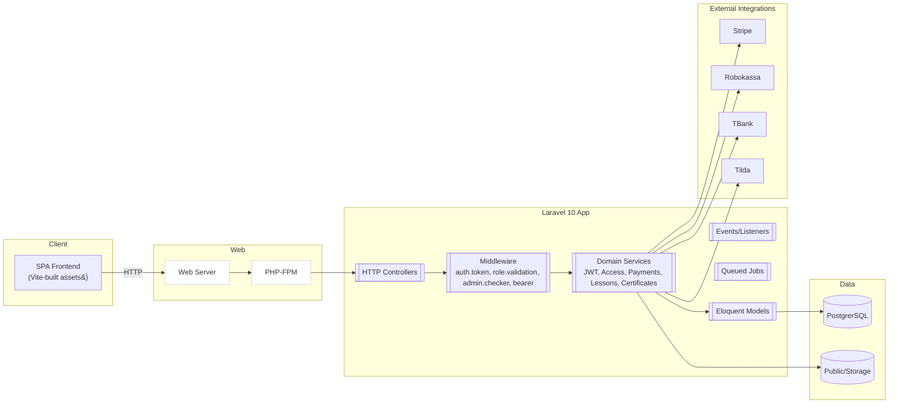

# Project Specification – LMS v1

## 1. Overview

- **Purpose of the project**: Learning Management System (LMS) backend with SPA front-end asset pipeline, providing course management, lessons, tests, analytics, integrations, and payment processing.
- **Current version and scope**: Laravel 10 PHP application with REST API endpoints and SPA catch-all routing. CI/CD via GitLab pipelines with Ansible-based deployment to remote hosts.

## 2. Architecture

### Technology Stack

- **Languages**:
  - PHP 8.1+ (README indicates 8.2; composer requires ^8.1)
  - JavaScript runtime: Node for Vite build (version not pinned; Vite ^5)
- **Frameworks/Libraries**:
  - Laravel Framework ^10.10
  - Firebase PHP-JWT ^6.10 (custom JWT flow)
  - Stripe PHP ^16.2
  - Vite ^5 with `laravel-vite-plugin`
- **Build/Tooling**:
  - Composer 2 (PHP dependencies)
  - Vite for asset bundling
  - PHPUnit ^10.1, Laravel Pint, Debugbar, L5-Swagger (dev)
- **Web server/runtime**: Not found in repository
- **Containerization**: Not found in repository
- **Orchestration**: Not found in repository

### Key Components & Modules

- **Application structure (`app/`)**:
  - `Http/Controllers/*`: Extensive domain modules including:
    - Auth, Profile, Course, Lesson, Reviews, Answers, Categories, Tags
    - Payments: Stripe, Robokassa, TBank (course and subscriptions)
    - Expert area: Course, Lesson, Modules, Products (Tariffs), Merchants, Analytics, Integrations (Tilda, Summit), Homework/Test, Curators, Import
    - Admin area: Users, Courses, Reviews, Answers, Support
    - Support tickets
    - Webhooks
  - `Http/Middleware/*`: Includes custom middleware such as `auth.token`, `role.validation`, `admin.checker`, `bearer` (implementations not shown; inferred from routing usage)
  - `Models/*`: Eloquent models (50 files)
  - `Services/*`: Domain services (e.g., JWT creation/decoding, AccessService, Certificate creation, Lesson content operations, Payments TBank service, Uploads)
  - `DTO/*`, `Queries/*`, `Rules/*`: Data transfer objects, query encapsulations, validators
  - `Events/*` + `Listeners/*`: Course change event/listener
  - `Jobs/*`: Recurring payment processing, import email processing
  - `Mail/*`: Email notifications (registration, reset password, subscription events, access emails)
  - `Providers/*`: Standard Laravel providers (App, Auth, Route, Event, Broadcast)
- **Configuration (`config/`)**:
  - `auth.php`: Guards `web` (session) and `api` (jwt)
  - `jwt.php`: JWT key configuration
  - `sanctum.php`: SPA stateful domains, middleware
  - `database.php`: PostgrerSQL default; SQLite, PostgreSQL, SQL Server configured
  - Standard Laravel configs (app, cache, session, mail, hashing, cors, queue, filesystems, services)
- **Routes**:
  - `routes/api.php`: Public and protected REST endpoints including auth, profile, courses, lessons, reviews, tags, support, payments, webhooks, expert (role-based), and admin (admin-checker)
  - `routes/web.php`: SPA catch-all to `SpaController@index`; payment endpoints; documents (serve PDFs based on domain TLD)
- **Frontend assets**:
  - `resources/` with `css`, `js`, `views`; built via Vite (`vite.config.js`)
  - SPA index served by `SpaController` (controller code not shown)
- **Public assets**:
  - SVGs, fonts, CSS, JS, documents/PDFs, `index.php`

### Infrastructure

- **Deployment**:
  - GitLab CI (`.gitlab-ci.yml`) with manual prod step and dev step:
    - Stages: `update-prod`, `update-dev`
    - Uses Ansible runner tag `ansible`
    - Scripts call functions that:
      - `cd .ansible`
      - Write target host from CI variables (`PROJECT_HOST_PROD` or `PROJECT_HOST_DEVELOP`) to an Ansible `hosts` file
      - Run `ansible-playbook update.yml` with `ANSIBLE_BECOME_PASSWORD`
  - Ansible (`.ansible/`):
    - `ansible.cfg`, `update.yml`, `roles/update/tasks/main.yml`, `group_vars/all/gitlab.yml`
    - Detailed task contents not included here; presence confirms IaC for deployment
- **CI/CD**:
  - Platform: GitLab CI
  - Triggering: `main` (prod manual), `develop` (dev automatic), except schedules
  - Secrets/variables expected in CI: `PROJECT_HOST_PROD`, `PROJECT_HOST_DEVELOP`, `ANSIBLE_BECOME_PASSWORD`
- **Containerization**: Not found in repository
- **Kubernetes**: Not found in repository
- **Terraform/Pulumi**: Not found in repository
- **Docker Compose**: Not found in repository

### Data Storage

- **Database**:
  - Default connection: `pgsql`
  - Configured connections: `sqlite`, `pgsql`, `sqlsrv`
  - Redis: configured using `phpredis`, with default and cache dbs
- **Schemas/Migrations**:
  - 58 migration files (`database/migrations`)
  - Factories and seeders present
  - Specific schema details: Not analyzed here; available across migrations
- **Files/Storage**:
  - `public/` and `storage/` standard Laravel structure
  - File uploads handled via `Services/UploadService.php` (implementation not reviewed)

### Integrations

- **Payments**:
  - Stripe (`stripe/checkout`, `stripe/charge`; course and subscription)
  - Robokassa (`payments/robokassa/endpoint` for web; init in API)
  - TBank (course and subscription endpoints, plus init APIs)
- **External services**:
  - Tilda integration (import students, filters, CRUD)
- **Email**:
  - Mail providers configured via `config/services.php` (`mailgun`, `postmark`, `ses`)
- **HTTP clients**:
  - Guzzle present for outbound HTTP calls

### Architecture Diagram

## 3. Security Posture

### Authentication & Authorization

- **Guards (`config/auth.php`)**:
  - `web`: session-based, provider `users` (Eloquent `App\Models\User`)
  - `api`: driver `jwt` (custom)
- **JWT configuration (`config/jwt.php`)**:
  - `key` from `env('JWT_KEY', 'secret')`
  - `video` from `env('VIDEO_JWT_TOKEN', 'video')`
- **Custom middleware (from routing)**:
  - `auth.token` and `auth.token:expert` for protected routes
  - `role.validation:<capabilities>` for RBAC-style checks in Expert/Admin areas
  - `admin.checker` for Admin routes
  - `bearer` for Summit webhook
- **Password resets**:
  - Standard Laravel password reset config using `password_reset_tokens` table
- **CSRF**:
  - Present via default middleware for `web` routes
- **Session management**:
  - Standard Laravel session config present (`config/session.php`) — details not analyzed

### Data Protection (Encryption, Secrets Management)

- **Secrets**:
  - `.env`-based configuration (README indicates `.env.example` present)
  - CI secrets via GitLab CI variables (`ANSIBLE_BECOME_PASSWORD`, hostnames)
- **JWT key**:
  - Default fallback is literal `'secret'` in `config/jwt.php` if `JWT_KEY` is not set; this is insecure for production if not overridden
- **Transport security**:
  - TLS/HTTPS termination: Not found in repository
- **At-rest encryption**:
  - Not found in repository
- **Hashing**:
  - Laravel hashing config present (`config/hashing.php`) — specifics not reviewed
- **Cookies**:
  - Cookie and session config present (`config/cookie.php`, `config/session.php`) — specifics not reviewed
- **CORS**:
  - `config/cors.php` present — specifics not reviewed
- **Rate limiting/throttling**:
  - Not found in repository (standard Laravel features may be available, but no explicit custom rate limiter found)

### Access Control and Roles

- Role-based middleware usage across Expert and Admin scopes:
  - Expert routes use `role.validation:<capabilities>` per endpoint (e.g., `create_course`, `update_lesson`, `analytic_sales`)
  - Admin routes protected by `admin.checker`
- Fine-grained permissions inferred by middleware combinations; implementation not shown here

### Dependency Posture

- **PHP dependencies (partial)**:

| Package | Version | Purpose |
|---|---:|---|
| php | ^8.1 | Runtime |
| laravel/framework | ^10.10 | Core framework |
| laravel/sanctum | ^3.3 | SPA auth cookies |
| firebase/php-jwt | ^6.10 | JWT handling |
| guzzlehttp/guzzle | ^7.2 | HTTP client |
| stripe/stripe-php | ^16.2 | Payments |
| ext-gd | * | Image processing |
| ext-curl | * | HTTP/Network |

Dev-only notable: darkaonline/l5-swagger, barryvdh/laravel-debugbar, laravel/pint, laravel/sail, phpunit/phpunit

- **JS dev dependencies**:

| Package | Version | Purpose |
|---|---:|---|
| vite | ^5.0.0 | Asset bundler |
| laravel-vite-plugin | ^1.0.0 | Laravel-Vite integration |
| axios | ^1.6.4 | HTTP client (frontend tooling) |

## 4. Key Features

### Major Functional Modules

- Authentication: Register, email confirmation, login, JWT check/refresh/logout, password reset
- Profile: User profile update, courses, favorites, certificates, public profile views
- Courses: Catalog, details, purchase flow, reviews (add/check/list)
- Lessons: Access, completion, tests (MCQ, open questions, classification), retakes
- Expert (author) area:
  - Campuses: CRUD, activation
  - Courses: CRUD, copy, activation, sorting lessons, modules CRUD
  - Lessons: CRUD, content management (create/update/clear/delete), gallery, sorting, copying
  - Reviews: View by course/id, reply management
  - Analytics: Sales, access, homework, student/lesson/course datasets, exports
  - Author settings: CRUD, account switch
  - Certificates: Create
  - Homework: Test checking, attempts clearing
  - Curators: Management and student assignment
  - Import: Access provisioning (users, mass operations)
  - Tariffs/Products: CRUD, mass operations
  - Merchants: Stripe/Robokassa/TBank credential CRUD
  - Integrations: Tilda integration CRUD and filters
- Payments:
  - Course payments: Stripe, Robokassa, TBank; web endpoints for callbacks
  - Subscriptions: Stripe and TBank (init/checkout/charge endpoints)
- Webhooks:
  - Tilda import
- Documents:
  - Offer/policy/contract PDFs served based on host TLD

### User Roles and Permissions

- Public (unauthenticated): Browse courses, categories, tags; initiate payments where allowed; event logging; some web document routes
- Authenticated user (`auth.token`): Profile operations, continue studying, course purchase, favorites, certificates, campus lookup, course content and tests
- Expert (`auth.token:expert` + `role.validation`): Author-level CRUD on courses/lessons/modules/products, analytics access, homework checks, curator management, import, integrations
- Admin (`admin.checker`): User/course/review/answer/support moderation and CRUD

### Current Limitations

- Containerization/Kubernetes: Not found in repository
- Infrastructure provisioning (cloud/IaaS) beyond Ansible: Not found in repository
- TLS/HTTPS handling, WAF/CDN details: Not found in repository
- Centralized secrets manager (e.g., Vault, SSM) integration: Not found in repository
- Security scanning (SAST/DAST/Dependency) in CI: Not found in repository

## 5. Observations

### Gaps, Risks, or Inconsistencies

- JWT key default: `config/jwt.php` falls back to `'secret'` if `JWT_KEY` is not set. This is insecure; production must set a strong secret in environment variables.
- Dual presence of Sanctum and custom JWT:
  - `api` guard is `jwt`; Sanctum config exists for SPA stateful cookies. Ensure consistent auth strategy and correct middleware application to avoid mixed-session/confusion.
- Custom critical middleware (`auth.token`, `role.validation`, `admin.checker`, `bearer`) are central to security posture; their implementations were not reviewed here. Security depends heavily on correctness of these.
- HTTPS/TLS:
  - No explicit configuration for SSL termination or secure cookies was found. Likely handled by infrastructure (Nginx/Load balancer), but not documented in repo.
- CI/CD:
  - GitLab CI relies on `ansible` tagged runners and environment variables for hosts and become password. Ensure runner security and variable scoping/protection.
- Lack of containerization:
  - No Docker/K8s manifests found. Deployment appears to be directly to VMs via Ansible playbook. Operational environments and PHP-FPM/webserver setup are not captured here.
- Rate limiting and abuse protection:
  - Not found in repository. Consider adding Laravel rate limiting for auth endpoints and webhooks.
- Auditing/logging:
  - Not explicitly documented. Laravel logging config exists; no explicit audit logs or security event tracking noted.

### Areas Needing Clarification

- Web server and PHP runtime topology (Nginx/Apache, PHP-FPM versions/config) — Not found in repository
- Exact JWT issuance/validation flow (`CreateJwtTokenService`, `JwtDecoderService`, `auth.token` middleware) — implementation details needed for full security review
- Role definitions and mapping to users/entities for `role.validation` — Not found in repository
- Payment webhook verification mechanisms (Stripe signatures, Robokassa, TBank) — Not found in repository
- Data schema for key entities (users/courses/lessons/tests/payments) — Available in migrations but not summarized here
- Secrets management practices beyond `.env` and GitLab CI vars — Not found in repository

Notes:

- Items marked “Not found in repository” indicate absence in the codebase scan, not necessarily absence in production.
