# Multi-Jurisdictional Compliance Analysis (🇷🇺 🇦🇪 🇪🇺 🇺🇸 🇨🇦)

 
Table of Contents

- [Executive Summary](#executive-summary)
- [Multi-Jurisdictional Compliance Matrix](#multi-jurisdictional-compliance-matrix)
- [Cross-Border Architecture](#cross-border-architecture)
- [Standards Mapping to Canonical Capabilities](#standards-mapping-to-canonical-capabilities)
- [Conflicts & Risks](#conflicts--risks)
- [Recommendations](#recommendations)

## Executive Summary

- Russia requires strict data localization (152‑FZ) and sectoral controls; Dubai/UAE PDPL permits transfers with safeguards; EU demands SCC 2021 with TIA; US sectoral (FERPA/COPPA) applies; Canada aligns with adequacy/contractual safeguards under PIPEDA.
- Repository shows strong org‑RLS isolation but no region/residency dimension. Implement region claims + RLS and split hosting to meet Russia/Dubai split and future EU/US.

## Multi-Jurisdictional Compliance Matrix

| Jurisdiction | Data Residency Requirement | Cross-Border Transfer Mechanism | Security Standards | Audit Requirements | Education/Child Rules |
|---|---|---|---|---|---|
| 🇷🇺 Russia | 152‑FZ: RU-only storage mandatory | Restricted; oversight by authorities | GOST R; RuNet DPI compliance | State inspections; KoAP Art. 13.11 penalties | None specific (general PD) |
| 🇦🇪 UAE/DIFC | UAE PDPL: Local preference | Adequacy/contractual safeguards | Cybersecurity compliance (federal + sectoral) | Breach notification (timely) | Limited, context-driven |
| 🇪🇺 EU | GDPR: Adequacy or SCCs + TIA | SCC 2021 + TIA (post‑Schrems II) | ISO 27001/SOC2 aligned | DPO; records; DPIAs | Strong child protections |
| 🇺🇸 US | No general residency | Sectoral plus commercial safeguards | NIST CSF; SOC2 Type II | Sectoral (FERPA/COPPA) | FERPA (education); COPPA (<13) |
| 🇨🇦 Canada | PIPEDA: assess cross‑border | Adequacy or contractual | ISO 27001 aligned | OPC oversight | Similar to EU approach |

Sources: see EXTERNAL-STANDARD anchors in `docs/reports/integration/2025-11/2025-11-06-0652-MSK-evidence-index.md`.

## Cross-Border Architecture

```mermaid
flowchart TD
    EU[🇪🇺 EU User] --> TIA{Transfer Impact\nAssessment}
    TIA -->|Adequate| SCC[Standard Contractual\nClauses 2021]
    TIA -->|Inadequate| BLOCK[❌ Transfer Blocked]
    SCC --> AE[🇦🇪 Dubai Processing]

    RU[🇷🇺 Russian User] --> LOC[152-FZ Localization\nCheck]
    LOC -->|Compliant| RUDB[(Russian Database\nGOST R Encrypted)]
    LOC -->|Violation| FINE[💸 18M RUB Fine Risk]

    US[🇺🇸 US User] --> FERPAQ{FERPA/COPPA\nApplicable?}
    FERPAQ -->|Yes| CONSENT[Parental Consent\nRequired]
    FERPAQ -->|No| AE
    CONSENT --> AE

    CA[🇨🇦 Canadian User] --> PIPEDA[PIPEDA Cross-Border\nAssessment]
    PIPEDA --> AE
```

## Standards Mapping to Canonical Capabilities

- Region controls: Implement `region_code` in JWT and region‑aware RLS (gap vs. 152‑FZ/GDPR/PDPL). Canonical anchors: [docs/API.md:Authentication Method:137-176], [docs/SUPABASE-DATABASE-REFERENCE.md:RLS Policies:639-707], [docs/SUPABASE-DATABASE-REFERENCE.md:Custom JWT Claims:729-746].
- Audit readiness: Job/event audit exists; extend to compliance log streams. Anchors: [docs/SUPABASE-DATABASE-REFERENCE.md:metric_* enums:620-666], [docs/API.md:Jobs Router:1200-1276].
- Incident handling: Add breach workflow runbooks for UAE PDPL (<72h guidance) and GDPR. Anchors: EXTERNAL-STANDARD (UAE PDPL, GDPR Articles 33/34).

## Conflicts & Risks

- GDPR vs. Russian localization: Cross‑border from RU to AE/EU is constrained; maintain strict RU isolation and avoid outbound transfers. ⚠️
- Schrems II residual risk for EU→AE processing: Requires TIA and SCC 2021 with supplementary measures; monitor government access risks. ⚠️
- Foreign agent law uncertainty for international partnerships in RU: Operational constraints possible; maintain domestic legal entity for RU operations. 🟥

## Recommendations

- Adopt Scenario B (AI Team Infrastructure) for enforceable region controls and auditability.
- Add `region_code` claim and RLS partitioning by region; deploy split infra (RU vs AE) and prepare EU/US cells.
- Prepare SCC 2021 + TIA pack; implement breach runbooks for UAE PDPL and GDPR Articles 33/34; segregate logs per region.

