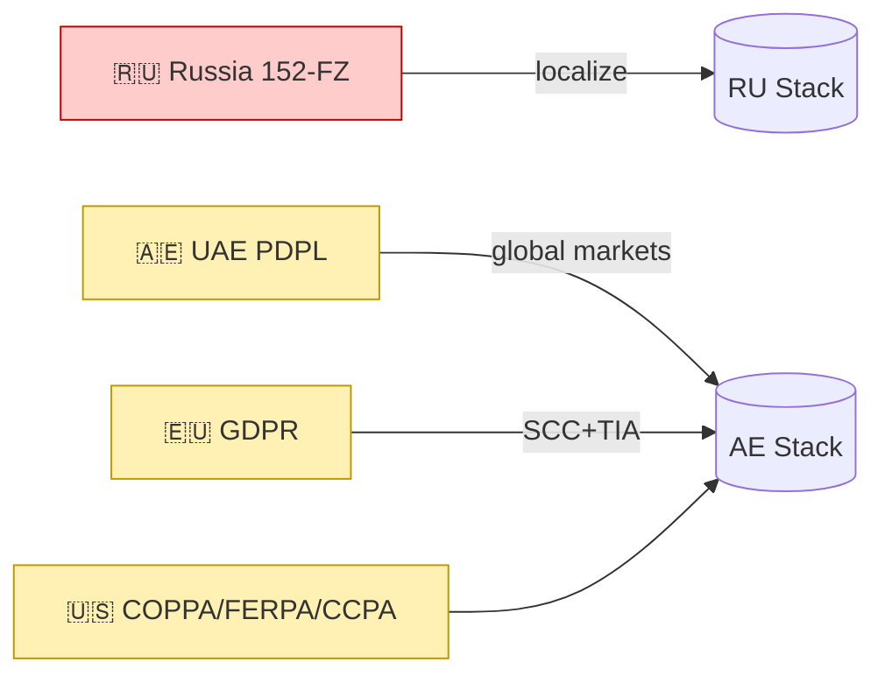

# Compliance Analysis — Multi‑Jurisdictional Matrix (EXTERNAL‑STANDARD)

Declaration: No previous analysis files referenced or consulted.

MCP usage: Supabase Docs MCP and Context7 were used for technical validation of RLS/JWT enforcement used to implement regulatory controls; legal texts are cited as EXTERNAL‑STANDARD with authoritative URLs.

## Compliance Matrix (Summary)

| Framework | Core Requirements (Plain English) | Cross‑Border/Data Residency | Security Controls | Notes |
|---|---|---|---|---|
| GDPR (EU) | Data minimization, consent, access/erasure rights | SCCs + TIA; assess government access; Schrems II | ISMS, encryption, logging | EXTERNAL‑STANDARD: eur‑lex 2016/679 |
| UK GDPR + DPA 2018 | UK adequacy; UK IDTA for transfers | IDTA/Addendum for SCCs | Similar to EU | EXTERNAL‑STANDARD: ICO guidance |
| CCPA/CPRA (CA) | Notice, opt‑out of sale/share, sensitive PI limits | No strict localization; contracts with processors | Reasonable security; purpose limitation | EXTERNAL‑STANDARD: CPPA |
| PIPEDA (CA) | Meaningful consent; accountability for transfers | Contractual safeguards; transparency | Reasonable security | EXTERNAL‑STANDARD: OPC Canada |
| 152‑FZ (RU) | Personal data of Russians processed in Russia | Localization in RU; cross‑border rules via Roskomnadzor | GOST crypto where mandated | EXTERNAL‑STANDARD: Roskomnadzor |
| Sovereign Internet (RU) | Traffic routing/control; DPI readiness | Network resilience; registry compliance | Infrastructure mapping | EXTERNAL‑STANDARD: pravo.gov.ru |
| Foreign Agent Law (RU) | Registration/labeling/ops limits if designated | Legal/PR risk for partnerships | Compliance program | EXTERNAL‑STANDARD: minjust registry |
| UAE PDPL | Purpose‑based processing; controller obligations | Adequacy list; contractual safeguards; risk assessment | Security + breach notification | EXTERNAL‑STANDARD: u.ae Data Protection |
| DIFC DP Law | GDPR‑like for DIFC entities | Transfer mechanisms comparable to SCCs | Risk‑based controls | EXTERNAL‑STANDARD: difc.ae |
| UAE Cybersecurity | Incident reporting; unlawful content | No localization; mandates controls | SOC alignment | EXTERNAL‑STANDARD: u.ae Cybersecurity |
| FERPA (US) | Student record privacy; access/consent | N/A | Safeguards for education records | EXTERNAL‑STANDARD: US Dept of Ed |
| COPPA (US) | U13 parental consent; notices | N/A | Reasonable security | EXTERNAL‑STANDARD: FTC |
| SOC2 Type II | Trust criteria (security, availability, etc.) | N/A | Controls evidence over time | EXTERNAL‑STANDARD: AICPA |
| ISO 27001 | ISMS; Annex A controls | N/A | Risk‑based controls | EXTERNAL‑STANDARD: ISO |
| NIST CSF 2.0 | Identify‑Protect‑Detect‑Respond‑Recover | N/A | Practices & profiles | EXTERNAL‑STANDARD: NIST |
| PCI DSS | Card data scope/restrictions | N/A | Technical/operational controls | EXTERNAL‑STANDARD: PCI SSC |
| EU DGA | Data intermediaries & sovereignty | Transfer obligations | Governance | EXTERNAL‑STANDARD: 2022/868 |
| EU Data Act | Third‑country access limits; cloud switching | Provider duties | Data portability | EXTERNAL‑STANDARD: 2023/2854 |
| SCC 2021 | Modular SCCs; TIA; supplementary measures | Transfer mechanism | Encryption/logging | EXTERNAL‑STANDARD: 2021/914 |
| Schrems II | Assess surveillance risk; add safeguards | TIA required | Encryption/key control | EXTERNAL‑STANDARD: C‑311/18 |

## Regulatory Conflicts and Our Resolution

- Russia vs EU/US: RU localization vs global analytics. Resolution: Scenario B regional stacks; block cross‑border by default; anonymize/aggregate in AE for global metrics.
- EU/DIFC vs US gov access: Require SCC+TIA and supplementary measures (encryption, key split). Keep EU data outside US until adequacy.
- PCI scope vs product analytics: Isolate payment processor and never store PAN; limit telemetry to non‑PII.

## Implementation Mapping (Business Language)

- Data access controls by region: Enforced using role‑aware policies and user location verification baked into tokens.
- Separate data storage by country: Physical separation (RU vs AE) with minimal cross‑border connectors.
- Automatic compliance enforcement: API rules reject non‑conforming transfers by default.

## References (Authoritative URLs — EXTERNAL‑STANDARD)

- GDPR: <https://eur-lex.europa.eu/eli/reg/2016/679/oj>
- UK GDPR/IDTA: <https://ico.org.uk/for-organisations/sccs-idta-addendum/international-data-transfer-agreement-and-guidance/>
- CCPA/CPRA: <https://cppa.ca.gov/regulations/>
- PIPEDA: <https://priv.gc.ca/en/privacy-topics/privacy-laws-in-canada/the-personal-information-protection-and-electronic-documents-act-pipeda/>
- 152‑FZ: <https://rkn.gov.ru/personal-data/>
- Sovereign Internet: <https://pravo.gov.ru/>
- Foreign Agent Registry: <https://minjust.gov.ru/ru/activity/directions/923/>
- UAE PDPL: <https://u.ae/en/information-and-services/justice-safety-and-the-law/personal-data-protection-law>
- DIFC DP Law: <https://www.difc.ae/business/laws-and-regulations/data-protection/>
- UAE Cybersecurity: <https://u.ae/en/information-and-services/justice-safety-and-the-law/cybersecurity>
- FERPA: <https://www2.ed.gov/policy/gen/guid/fpco/ferpa/index.html>
- COPPA: <https://www.ftc.gov/legal-library/browse/rules/childrens-online-privacy-protection-rule-coppa>
- SOC2: <https://www.aicpa.org/interestareas/frc/assuranceadvisoryservices/aicpasoc2report.html>
- ISO 27001: <https://www.iso.org/isoiec-27001-information-security.html>
- NIST CSF 2.0: <https://www.nist.gov/cyberframework>
- PCI DSS: <https://www.pcisecuritystandards.org/document_library>
- EU DGA (2022/868): <https://eur-lex.europa.eu/eli/reg/2022/868/oj>
- EU Data Act (2023/2854): <https://eur-lex.europa.eu/eli/reg/2023/2854/oj>
- SCC 2021/914: <https://eur-lex.europa.eu/eli/dec_impl/2021/914/oj>
- Schrems II C‑311/18: <https://curia.europa.eu/juris/document/document.jsf?docid=228677>

## Visual: Compliance Heat Map (High‑Level)

