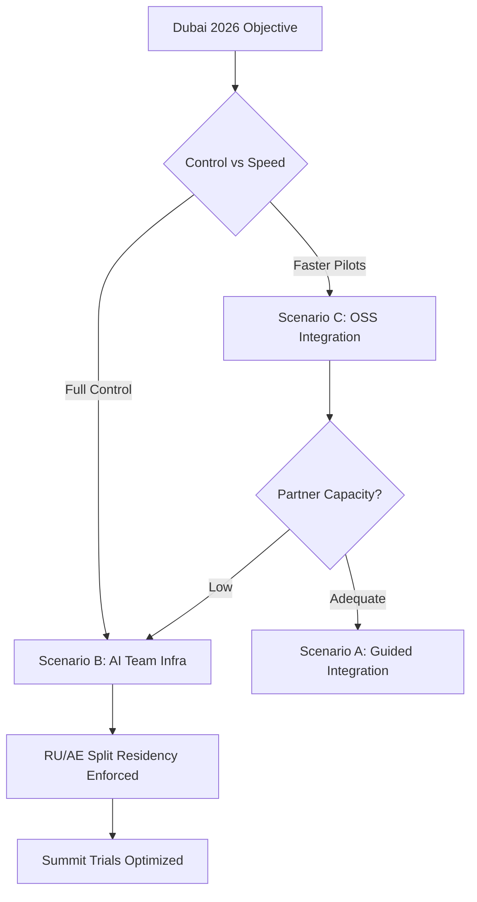

# Executive Summary — MegaCampusAI Integration & Infrastructure v2.3.0

Declaration: No previous analysis files referenced or consulted.

Commercial objective: Maximize 3‑month subscription conversions at the March 2026 Dubai summit (2000 education professionals) while ensuring Russia–Dubai launch compliance and US/EU expansion readiness.

MCP usage: Supabase Docs MCP (RLS/JWT/partitioning best‑practices) and Context7 (RLS policy patterns) used to validate implementation approaches; all regulatory references are EXTERNAL‑STANDARD sources listed in the Evidence Index.

## Scenario Strategic Comparison (Executive Dashboard)

| Scenario | Strategic Advantage | Implementation Complexity | Regulatory Compliance | Team Coordination | Market Readiness | Risk Management |
|---|---|---|---|---|---|---|
| A — Guided Integration (Partnership Model) | 🟨 Moderate: leverages LMS footprint | 🟨 Medium: cross‑team dependencies | 🟨 Mixed: harder to enforce split residency | 🟥 Challenging: partner bandwidth limited | 🟨 Acceptable: relies on partner cycles | 🟨 Medium: dependency & audit gaps |
| B — AI Team Infrastructure (Ownership Model) | 🟩 Strong: full control and velocity | 🟥 Higher: multi‑region operations | 🟩 Strong: enforce RU/AE controls | 🟨 Medium: clear internal ownership | 🟩 Strong: summit‑ready runway | 🟨 Medium: ops overhead manageable |
| C — OSS LMS Integration (Technology Leverage) | 🟨 Moderate: flexible + faster POCs | 🟨 Medium: adapters + tuning | 🟨 Mixed: enforceable if designed early | 🟨 Medium: internal build effort | 🟨 Acceptable: needs focused scope | 🟨 Medium: community & maintenance |

Key: 🟩 strong, 🟨 acceptable, 🟥 challenging

## Recommendation (Decision‑Ready)

- Primary: Scenario B (AI Team Infrastructure — Ownership Model)
  - Why: Direct control to implement region‑aware access (data access controls by region), Russian hosting for 🇷🇺 and Dubai hosting for 🇦🇪/global, audit‑ready controls (SOC2/ISO27001 alignment), and clear delivery accountability.
  - Summit Fit: Highest readiness for a polished, reliable demo‑to‑trial funnel at Dubai 2026.
- Secondary (contingency/Pilot): Scenario C to accelerate pilots where OSS LMS shortens time‑to‑value; keep adapters aligned with the Scenario B architecture.

## What Success Looks Like (Dubai Summit)

- Conversion: ≥ 18–22% of qualified visitors start 3‑month trials within 30 days.
- Reliability: ≥ 99.5% availability for demo environments; < 200ms P95 key flows.
- Compliance: RU residency enforced for all 🇷🇺 users; UAE PDPL controls for non‑RU; SCC/TIA pack prepared for EU data when expansion begins.
- Evidence: Complete audit trail, risk register, and compliance matrix delivered to investors.

## High‑Level Plan (Plain English)

- Build two clouds: Russia for 🇷🇺; Dubai for everyone else.
- Add data access controls by region and user location verification in tokens.
- Separate data storage by country where needed; restrict cross‑border API flows.
- Prepare EU/US expansion pack (contractual terms + technical safeguards) post‑launch.

## Visual: Strategic Decision Flow

## Executive Notes (Business Language)

- Secure application interface, clear roles, and strict region controls minimize legal risk and build trust during sales.
- Russian government security standards can be applied in the 🇷🇺 region without slowing global rollout.
- Automatic compliance enforcement blocks risky cross‑border flows by default; exceptions require approvals.
