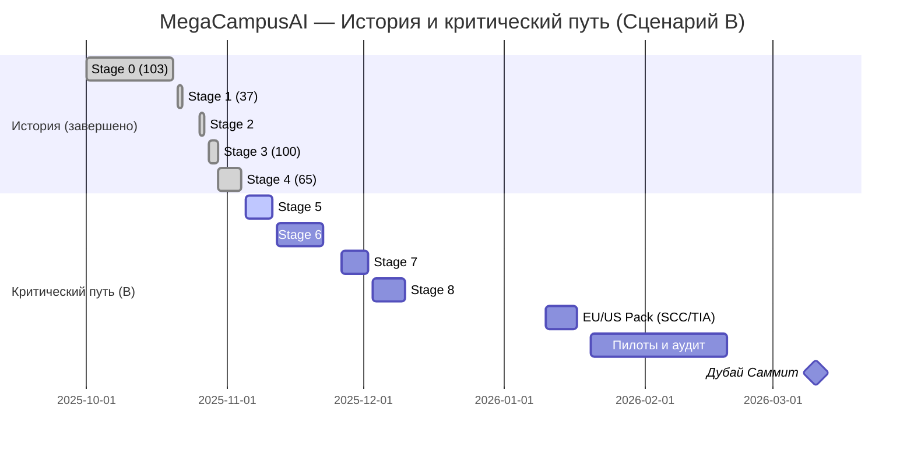

# Исполнительная презентация (Outline) — Три сценария запуска MegaCampusAI

Заявление: предыдущие отчёты не использовались; выводы основаны на текущих канонических файлах и EXTERNAL-STANDARD источниках.

## Слайд 1 — Цель и контекст
- Цель саммита Дубай (март 2026): максимально конвертировать 3‑месячные подписки
- Контекст запуска: 🇷🇺 данные/пользователи — в РФ; остальные — в 🇦🇪 (Дубай)
- Видение: быстрый рост с подтверждённой регуляторной дисциплиной и прозрачным аудитом

## Слайд 2 — Три сценария (коротко, простым языком)
- A. Руководим интеграцией партнёра (Guided Integration): мы консультируем, партнёр встраивает
- B. Собственная инфраструктура (Ownership): мы строим и управляем двумя стеками (РФ/Дубай)
- C. Интеграция с OSS LMS: берём зрелую открытую LMS + наши адаптеры

## Слайд 3 — Рекомендация
- Основная: Сценарий B — максимальный контроль качества и комплаенса, самый надёжный путь к конверсиям на саммите
- Резерв: Сценарий C — ускоренные пилоты под наши адаптеры, питает B
- Условный: Сценарий A — только при чётких SLA и выделенной ёмкости партнёра

## Слайд 4 — Почему это важно бизнесу
- Прозрачный контроль по регионам = ниже юр. риски и выше доверие закупщиков
- Быстрые итерации без внешних блокеров = конкурентное преимущество на демо
- Аудит‑готовность (SOC2/ISO) = уверенность инвесторов и крупных клиентов

## Слайд 5 — Комплаенс «по‑человечески»
- «Контроль доступа к данным по регионам»: кто и где видит данные — решает политика
- «Проверка локации пользователя»: признак «region_code» в токене
- «Раздельное хранение по странам»: РФ хранится в РФ; остальное — в Дубае
- «Автоматическое ограничение трансграничных API»: по умолчанию — блок, исключения — по процессу

## Слайд 6 — Сравнение сценариев (для менеджеров)

| Сценарий | Стратегия | Сложность внедрения | Регуляторика | Координация | Готовность рынка | Риски |
|---|---|---|---|---|---|---|
| A | 🟨 | 🟨 | 🟨 | 🟥 | 🟨 | 🟨 |
| B | 🟩 | 🟥 | 🟩 | 🟨 | 🟩 | 🟨 |
| C | 🟨 | 🟨 | 🟨 | 🟨 | 🟨 | 🟨 |

Легенда: 🟩 сильная сторона, 🟨 приемлемо, 🟥 сложно

## Слайд 7 — Дорожная карта (факты из репозитория)
- Исторические факты (файлы: IMPLEMENTATION_ROADMAP_EN.md, TECHNICAL_SPECIFICATION_PRODUCTION_EN.md):
  - Stage 0: 103 задачи, завершено 2025‑10‑20 (~2.5 недели)
  - Stage 1: 37 задач, завершено 2025‑10‑22
  - Stage 2: завершено 2025‑10‑27 (факт: «6 часов» vs 5–7 дней по плану)
  - Stage 3: 100 задач, завершено 2025‑10‑29 (~2 недели)
  - Stage 4: 65 задач, завершено 2025‑11‑04
- Вывод по скорости (основано на этапах):
  - Инфраструктура: устойчиво 6–10 задач/день
  - Функционал: пики 18–34 задач/день
  - Качество/проверки: +20–30% буфер к оценке сроков

### Визуал 1 — Gantt (история + критический путь B)

Примечание: длительности Stage 5–8 включают буфер 20–30% на проверки/тесты.

## Слайд 8 — Риски и контроль
- RU локализация: отдельный стек РФ, блок межстрановых вызовов по умолчанию, аудит логов
- Зависимость от партнёра (A): только при SLA и выделенных спринтах
- Многостековая операционка (B): инфраструктура‑как‑код, мониторинг, регламенты
- EU трансферы: SCC 2021 + TIA + раздельные ключи шифрования

## Слайд 9 — KPI саммита и метрики
- Конверсия 3‑месячных пробных: 18–22% целевой диапазон
- Надёжность демо‑окружений: ≥99.5%, P95 <200мс для ключевых операций
- Комплаенс: пройденные чек‑листы RU/AE; готовые TIA/SCC пакеты для EU

## Слайд 10 — Следующие шаги (30/60/90)
- 30 дней: Stage 5–6, региональные политики, метрики/логи
- 60 дней: Stage 7–8, пилоты, комплаенс‑аудит, EU‑пакет
- 90 дней: запуск кампаний, систематизация продаж, подготовка к саммиту

---

## Приложение — Доказательная база (репозиторий)
- docs/IMPLEMENTATION_ROADMAP_EN.md: статусы, длительности, задачи по этапам
- docs/TECHNICAL_SPECIFICATION_PRODUCTION_EN.md: метрики Stage 3–4, завершения по датам
- docs/SUPABASE-DATABASE-REFERENCE.md: контроль доступа по регионам (RLS/JWT) — основа для комплаенса

## Приложение — Термины на простом языке
- «Secure application interface» → «Безопасный интерфейс приложения»
- «RLS policies» → «Контроль доступа к данным по регионам»
- «JWT region claims» → «Признак региона в токене»
- «GOST R cryptography» → «Российские госстандарты по безопасности»
- «Database partitioning» → «Раздельное хранение данных по странам»
- «Cross-border API restrictions» → «Автоматическое ограничение трансграничных вызовов»
