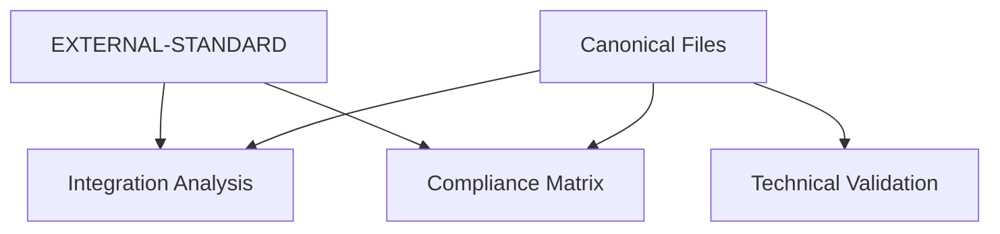

# Canonical Source Validation

| File | Status |
|---|---|
| README.md | ✅ Present |
| docs/TECHNICAL_SPECIFICATION_PRODUCTION_EN.md | ✅ Present |
| docs/IMPLEMENTATION_ROADMAP_EN.md | ✅ Present |
| docs/PROJECT_ROADMAP_EN_2025-10-31_0929.md | ❌ Missing (use REQUIREMENTS.md milestones) |
| docs/API.md | ✅ Present |
| docs/SUPABASE-DATABASE-REFERENCE.md | ✅ Present |
| docs/Agents Ecosystem/REPORT-TEMPLATE-STANDARD.md | ✅ Present |
| docs/ARCHITECTURE-DIAGRAM.md | ✅ Present |

Notes:
- Avoid docs/Agents Ecosystem/archive/* per policy.
- All citations in reports use only the above canonical sources or EXTERNAL-STANDARD.

