# Consolidated Integration Report — Scenario A vs B vs C

<details> <summary>Table of Contents</summary>

- [Consolidated Integration Report — Scenario A vs B vs C](#consolidated-integration-report--scenario-a-vs-b-vs-c)
  - [Executive Summary](#executive-summary)
  - [Scenario Definitions](#scenario-definitions)
  - [Russia-Dubai Split Architecture](#russia-dubai-split-architecture)
  - [Scenario Comparison](#scenario-comparison)
  - [Multi-Jurisdictional Compliance Mapping](#multi-jurisdictional-compliance-mapping)
  - [Risk Assessment](#risk-assessment)
  - [Recommendations](#recommendations)
  - [Evidence Anchors](#evidence-anchors)

</details>

## Executive Summary

- Objective: Maximize 3‑month subscription conversions for March 2026 Dubai summit while enabling RU/AE split with future EU/US expansion.
- Verdict: Scenario B (AI Team Infrastructure) best aligns with enforceable data residency, auditability, and roll‑out speed given team profiles and constraints.

!!! CRITICAL DECISION
Scenario B (AI Team Infrastructure) selected for Russia‑Dubai split deployment due to enforceable data residency and comprehensive audit capabilities.

## Scenario Definitions


## Russia-Dubai Split Architecture

```mermaid
flowchart LR
RU[🇷🇺 Russia Region<br/>GOST R crypto<br/>152-FZ storage] -->|JWT region_code| API[API Gateway<br/>tRPC over HTTP]
AE[🇦🇪 Dubai Region<br/>UAE PDPL<br/>Global users] -->|Residency checks| API
API -->|Multi-tenant routing| SVC[Orchestrator<br/>BullMQ]
SVC --> DB[(Supabase PostgreSQL<br/>RLS by region)]
DB -. RLS: region=RU .- RU
DB -. RLS: region=AE .- AE
```



## Scenario Comparison

| Scenario | Time-to-MVP | Cost | Risk | Regulatory-fit | Global-scalability | Team-fit | Integration-complexity | Key Evidence |
|---|---:|---:|---:|---:|---:|---:|---:|---|
| A: Guided Integration | 3/5 | 2/5 | 4/5 | 2/5 | 3/5 | 2/5 | 4/5 | [docs/API.md:60-122], [docs/TECHNICAL_SPECIFICATION_PRODUCTION_EN.md:826-899] |
| B: AI Team Infrastructure | 4/5 | 3/5 | 2/5 | 4/5 | 4/5 | 4/5 | 2/5 | [docs/SUPABASE-DATABASE-REFERENCE.md:639-707], [docs/API.md:137-176] |
| C: OSS Integration | 4/5 | 3/5 | 3/5 | 3/5 | 4/5 | 3/5 | 3/5 | EXTERNAL-STANDARD (Moodle/Canvas) |

Legend: 1=Poor, 2=Below Average, 3=Adequate, 4=Good, 5=Excellent

## Multi-Jurisdictional Compliance Mapping

- RU: Strict localization; require `region_code="RU"` and RU‑only data path. Add RLS by region and separate infra. Anchors: [docs/SUPABASE-DATABASE-REFERENCE.md:639-707].
- AE: PDPL permits processing for global users with lawful basis; ensure breach response workflow. EXTERNAL-STANDARD (UAE PDPL).
- EU: Use SCC 2021 + TIA; restrict sensitive flows; consider EU region post‑launch. EXTERNAL-STANDARD (SCC 2021, EDPB 01/2020, Schrems II).
- US/CA: Sectoral and PIPEDA-compatible; enable consent/age gates (COPPA) and education privacy; plan for region cells later.

## Risk Assessment

Risk Assessment Matrix (Probability × Impact)

```text
    Impact →
    Low    Medium   High
P Hi   🟨      🟥       🟥
r Med  🟩      🟨       🟥  
o Low  🟩      🟩       🟨

🟩 = Low Risk    🟨 = Medium Risk    🟥 = High Risk
```

Top categories: 🟥 Residency breach in RU; 🟥 Schrems II adequacy challenge (EU→AE); 🟨 Runbook maturity (UAE PDPL).

## Recommendations

- Implement Scenario B with: region claim in JWT, region‑aware RLS, RU/AE infra split, SCC 2021 + TIA pack, breach runbooks (GDPR + PDPL), audit logging per region.
- Prepare EU cell for post‑summit expansion; add FERPA/COPPA paths for US.

## Evidence Anchors

- Canonical: [docs/API.md:137-176], [docs/SUPABASE-DATABASE-REFERENCE.md:639-707], [docs/IMPLEMENTATION_ROADMAP_EN.md:296], [docs/ARCHITECTURE-DIAGRAM.md:895-897]
- External: See `docs/reports/integration/2025-11/2025-11-06-0652-MSK-evidence-index.md` (EXTERNAL-STANDARD list)
