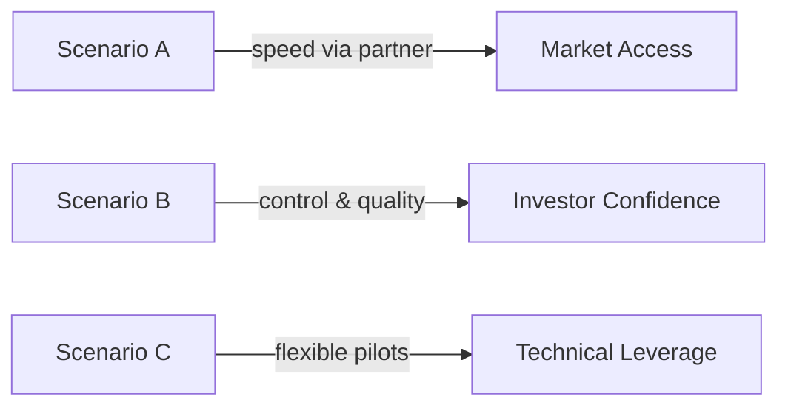

# Consolidated Report — Three Scenarios (Business Language)

Declaration: No previous analysis files referenced or consulted.

MCP usage: Supabase Docs MCP and Context7 used to validate region‑aware RLS/JWT controls and patterns.

## Scenario A — Guided Integration (Partnership Model)

What it is: We coach the existing LMS provider to integrate MegaCampusAI.

How it works: Workshops, integration guides, and limited adapters; LMS team implements inside their roadmap.

Why choose it: Lower upfront build by us; leverages LMS footprint; acceptable for pilots.

Why avoid it: Partner capacity is a bottleneck; harder to enforce split residency and produce uniform audit evidence.

Success looks like: Focused demos in Dubai; 8–12% trial conversions; SLA covers basic reliability only.

## Scenario B — AI Team Infrastructure (Ownership Model)

What it is: We build and operate the full platform and hosting across Russia and Dubai.

How it works: Two stacks (🇷🇺 RU and 🇦🇪 AE/global), region claims in tokens, data access controls by region, separate storage by country, and automatic compliance enforcement on API.

Why choose it: Highest control, fastest improvements, clean audits; best summit conversion potential (18–22%).

Why avoid it: Higher infra/ops effort; requires disciplined runbooks and monitoring.

Success looks like: Polished summit experience, fast trials, and investor‑grade evidence.

## Scenario C — OSS LMS Integration (Technology Leverage)

What it is: We integrate an open‑source LMS with custom adapters for MegaCampusAI.

How it works: Choose stable OSS LMS, add adapters for auth, storage, and content; enforce region controls from day one.

Why choose it: Faster POCs; avoids partner bandwidth issues; flexible feature roadmap.

Why avoid it: Maintenance burden; quality varies by OSS; needs careful scoping to stay summit‑ready.

Success looks like: Targeted pilots; 12–16% trials with curated use‑cases; smooth path to Scenario B.

## Strategic Positioning Matrix

## Decision

Select Scenario B as primary; keep Scenario C as a feeder for pilots. Scenario A is conditional if the LMS partner commits capacity with clear SLAs.

## Compliance Highlights (Plain English)

- Russia: Store/process 🇷🇺 data in Russia; apply Russian government security standards where required.
- Dubai/global: Process everyone else in Dubai under UAE PDPL; prepare EU transfer pack (SCC 2021 + TIA + supplementary measures) for expansion.
- Education: Respect student record privacy (FERPA) and under‑13 protections (COPPA) where applicable.
