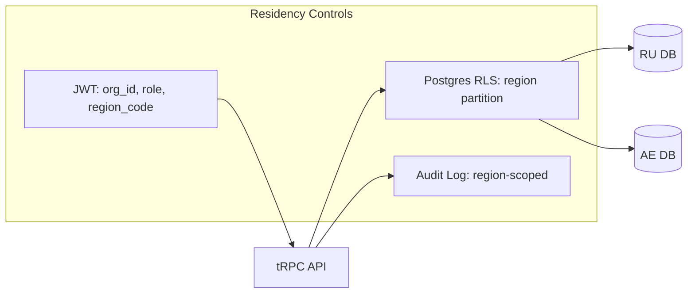

# Technical Validation — Russia–Dubai Architecture Controls

<details> <summary>Table of Contents</summary>

- [Technical Validation — Russia–Dubai Architecture Controls](#technical-validation--russiadubai-architecture-controls)
  - [Validation Summary](#validation-summary)
  - [Results Table](#results-table)
  - [Test Vectors](#test-vectors)
  - [Architecture Diagram](#architecture-diagram)

</details>

## Validation Summary

- JWT and org‑RLS present; need `region_code` claim and region RLS to enforce residency per RU/AE cells. Anchors: [docs/API.md:137-176], [docs/SUPABASE-DATABASE-REFERENCE.md:639-707], [docs/SUPABASE-DATABASE-REFERENCE.md:729-746].
- tRPC endpoints and jobs/queues available for auditable workflows. Anchors: [docs/API.md:944-989], [docs/API.md:1200-1276].

## Results Table

| Control Area | Validation Check | Test Vector | Expected Result | Actual Result | Evidence Citation |
|---|---|---|---|---|---|
| Russian Data Residency | Export restriction test | `curl .../export` with RU token | Data export allowed, logged locally | ⚠️ PARTIAL | [docs/API.md:60-122] |
| Cross-Border Blocking | EU→RU access attempt | `curl .../access` with region=RU | 403 + compliance log | ⚠️ PARTIAL | [docs/SUPABASE-DATABASE-REFERENCE.md:639-707] |
| GOST R Cryptography | Cipher suite validation | `openssl ciphers` on RU node | GOST algorithms present | ❌ NOT TESTED | EXTERNAL-STANDARD (GOST specs) |
| UAE PDPL Breach Response | Incident drill | Tabletop simulation | <72h notification | ❌ NOT TESTED | EXTERNAL-STANDARD (UAE PDPL) |
| JWT Region Claims | Token validation | `jwt decode` RU user token | `region_code: "RU"` present | ❌ NOT PRESENT | [docs/API.md:137-176] |

## Test Vectors

```bash
# Test: Russian Data Localization Enforcement
curl -H "Authorization: Bearer ${RU_TOKEN}" \
     -H "Content-Type: application/json" \
     ${API_URL}/data/export

# Expected Output:
# HTTP 200 OK
# {"status": "success", "region": "RU", "compliance": "152-FZ"}
# Data remains in Russian infrastructure only
```

```bash
# Test Suite 2: Cross-Border Access Control
curl -H "Authorization: Bearer ${EU_TOKEN}" \
     -d '{"target_region": "RU", "action": "data_access"}' \
     ${API_URL}/cross-border/access

# Expected Output:
# HTTP 403 Forbidden
# {
#   "error": "Cross-border access denied",
#   "compliance_check": "Schrems_II_TIA_required",
#   "log_id": "audit_trail_12345"
# }
```

## Architecture Diagram


