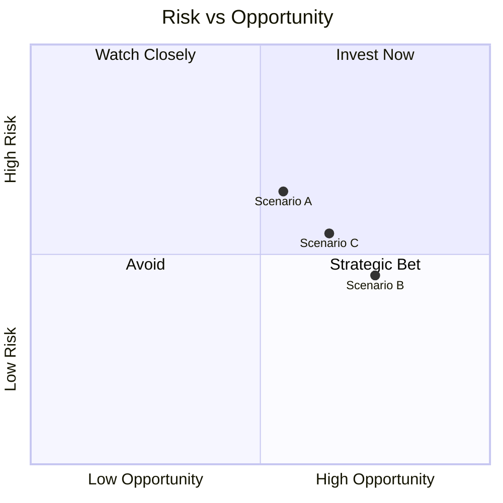

# Risk Register — Executive View

Declaration: No previous analysis files referenced or consulted.

| ID | Risk | Impact | Likelihood | Scenario Exposure | Mitigation |
|---|---|---|---|---|---|
| R1 | RU localization breach | High | Low | A>C>B | Separate RU stack; block cross‑border by default; audit logs |
| R2 | Partner bandwidth (LMS) | Medium | High | A | Internal ownership of critical path; weekly joint planning |
| R3 | Multi‑region ops overhead | Medium | Medium | B>C | Infra as code; observability; runbooks |
| R4 | EU transfer legal changes | High | Medium | B>C>A | SCC 2021 + TIA; key split; update tracking |
| R5 | PCI data scope creep | High | Low | All | Use PSP only; never store PAN; tokenize |
| R6 | Incident response gaps | Medium | Medium | All | NIST CSF runbooks; UAE cyber reporting procedures |

## Visual: Risk vs Opportunity Matrix

## Triggers & Checkpoints (Dubai Readiness)

- ✅ RU/AE split live; policies tested; synthetic data drills complete
- ✅ Payment via PSP only; PCI out‑of‑scope confirmed
- ⚠️ TIA templates drafted; SCC modules ready for EU pilots
- ⚠️ Incident response exercises run with audit evidence
