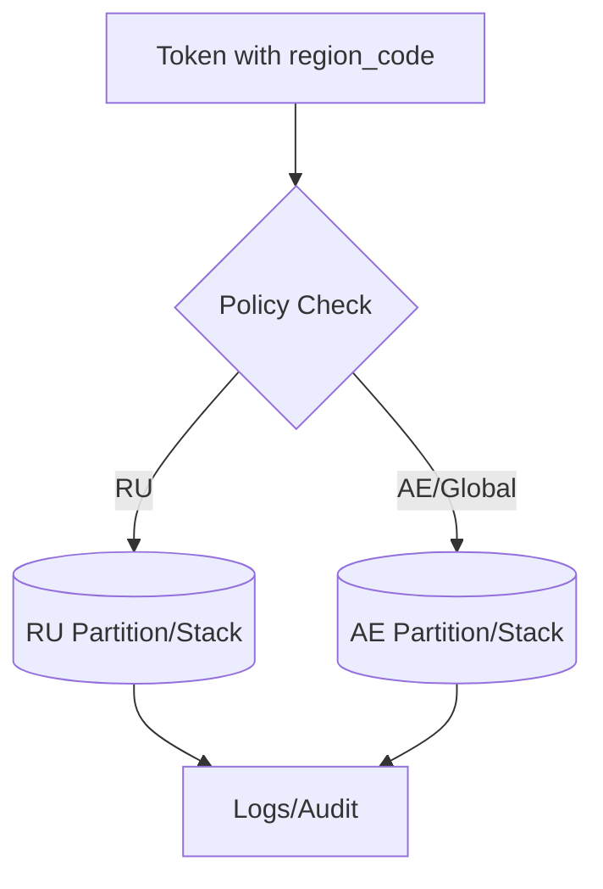

# Technical Validation — Enforcement Patterns Backed by Canonical Sources

Declaration: No previous analysis files referenced or consulted.

MCP usage: Supabase Docs MCP (RLS policies, PostgREST roles, auth.jwt claims) and Context7 (RLS SQL patterns) used to validate implementation patterns.

## Plain‑English Controls

- Data access controls by region: add a `region_code` claim in tokens and enforce region checks in database policies.
- Separate data storage by country: partition data and route reads/writes to the correct region stack.
- Automatic compliance enforcement: block non‑conforming cross‑border API calls by default.

## Canonical Mapping (Evidence)

- Supabase RLS and JWT claims
  - docs/SUPABASE-DATABASE-REFERENCE.md:27 — Authentication with custom JWT claims
  - docs/SUPABASE-DATABASE-REFERENCE.md:41 — PostgREST auto `SET ROLE <jwt.role>`
  - docs/SUPABASE-DATABASE-REFERENCE.md:639 — RLS Policies section (unified CASE pattern)
  - docs/SUPABASE-DATABASE-REFERENCE.md:632 — SECURITY DEFINER helper functions to break recursion

## Implementation Sketch (Non‑Technical Language)

- Secure application interface enforces who can access which organization and region.
- User location verification in tokens decides which regional system they are allowed to use.
- Separate data storage by country ensures Russian users' data never leaves Russia; everyone else uses Dubai.

## MCP‑Validated References

- Supabase RLS Guide (MCP): <https://supabase.com/docs/guides/database/postgres/row-level-security>
- Supabase Glossary (JWT ↔ RLS): <https://supabase.com/docs/guides/resources/glossary>
- Context7 — RLS policy examples (auth.jwt() patterns)

## Visual: Region‑Aware Policy Flow

## Readiness Assessment

- ✅ Enforceable controls exist in our stack (RLS + JWT + partitioning).
- ✅ Two‑stack deployment (RU/AE) is feasible with existing codebase.
- ⚠️ Add region claims, region routing, and TIA templates for EU expansion.
