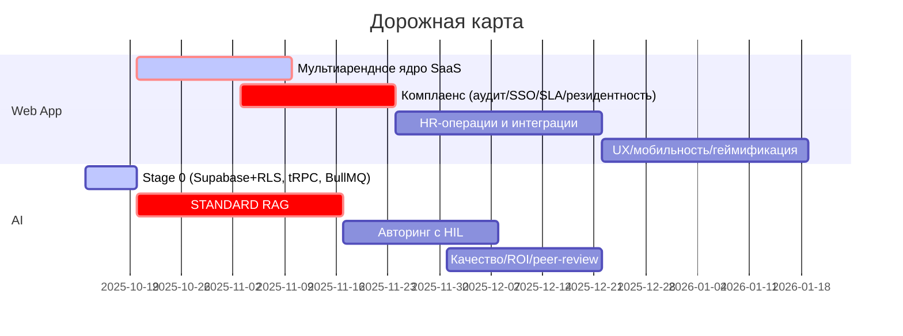

# Дорожная карта LMS – v1 → v2 → AI‑будущее

## 1\. Стратегические цели

- Превратить текущую B2C‑платформу (Laravel/SPA) в мультиарендный B2B2C SaaS с ролью «заказчик‑организация», изоляцией данных и публичными B2B‑интеграциями. (Point A → Point B)  
- Обеспечить требования Point D с первого дня: 152‑ФЗ (резидентность данных в РФ), аудит‑логи, SSO/SAML для Enterprise, SLA по тарифам, резервное копирование и безопасность. (источник: docs/PRICING-TIERS.md)  
- Запустить AI‑фундамент (Supabase Auth \+ RLS, tRPC, BullMQ, Qdrant \+ Jina) и отдать приоритет STANDARD‑тарифу как оптимальному по качеству/стоимости. (источники: specs/001-stage-0-foundation/spec.md, docs/PRICING-TIERS.md)  
- Закрыть методические и бизнес‑пробелы: встроенные валидаторы качества контента, атрибуция источников, ROI‑метрики, P2P/peer‑review. (источник: «\# 📊 Сводная таблица анализа LMS.md»)

Если требование Point D отсутствует в материалах, помечаем как: «Not found in provided inputs».

## 2\. Эпики

### \[Web App – Команда инвесторов\]

1) \[Web App\] Мультиарендное ядро SaaS  
   — Организации, роли (системный админ, HR‑директор, руководитель, обучающийся), изоляция данных, публичные B2B‑API. (Point B)  
     
2) \[Web App\] Доступ предприятия и комплаенс  
   — Аудит‑логи (по уровням тарифов), SSO/SAML, SLA‑мониторинг, резидентность и ретенция данных. (Point D, docs/PRICING-TIERS.md)  
     
3) \[Web App\] HR‑операции и интеграции  
   — HR‑кабинет, импорт должностей из 1С, матрицы компетенций, сертификация с отчётностью (ФРДО). (Point B)  
     
4) \[Web App\] Опыт обучающихся и вовлечённость  
   — Персональные панели, мобильная адаптивность и офлайн‑кэш, геймификация, дискуссии/peer‑review. (Point B \+ выявленные пробелы)

### \[AI Features – Команда автора\]

5) \[AI\] Stage 0: инфраструктура и безопасность  
   — Supabase+RLS, тRPC, BullMQ, схемы БД, валидация файлов/квоты по тарифам. (specs/001-stage-0-foundation/spec.md)  
     
6) \[AI\] STANDARD RAG и контент‑интеллект  
   — Docling→Markdown, иерархический чанкнинг, Jina‑векторизация, Qdrant (dense+BM25), метаданные/атрибуция. (docs/PRICING-TIERS.md)  
     
7) \[AI\] Интерактивный авторинг с HIL  
   — 9‑шаговый мастер, генерация структуры/уроков/тестов, человек‑в‑контуре с правками и утверждением. (CourseAI.md)  
     
8) \[AI\] Качество, соответствие и ROI  
   — Валидаторы JSON/ссылок/фидбэка, KPI‑сбор (Phillips 3–5), P2P/peer‑review, отчёты. (обзор пробелов)

## 3\. Истории (Implementation‑ready)

### Эпик 1: Мультиарендное ядро SaaS

- \[Web App\] Как архитектор, я хочу модель организаций и ролей (sysadmin, HR, manager, learner) с RLS‑изоляцией, чтобы каждый клиент видел только свои данные.  
- \[Web App\] Как DevOps‑инженер, я хочу деплой в РФ‑регионах и автоматизацию окружений, чтобы выполнить 152‑ФЗ и ускорить масштабирование.  
- \[Web App\] Как интегратор, я хочу публичные B2B‑API с tenant‑scope JWT, чтобы внешние системы безопасно синхронизировали курсы и статусы.

### Эпик 2: Доступ предприятия и комплаенс

- \[Web App\] Как enterprise‑админ, я хочу SSO/SAML и кастомные домены, чтобы платформа подключалась к корпоративной IAM. (docs/PRICING-TIERS.md)  
- \[Web App\] Как офицер безопасности, я хочу аудит‑логи с ретенцией по тарифам (30/90/365 дней), чтобы соответствовать контрактным требованиям. (docs/PRICING-TIERS.md)  
- \[Web App\] Как владелец сервиса, я хочу SLA‑мониторинг и отчётность, чтобы подтвердить уровни 99–99.9% в зависимости от тарифа. (docs/PRICING-TIERS.md)

### Эпик 3: HR‑операции и интеграции

- \[Web App\] Как HR‑директор, я хочу импорт должностей из 1С и матрицу компетенций, чтобы автоматизировать назначения обучения.  
- \[Web App\] Как специалист по комплаенсу, я хочу сертификацию с отчётностью (ФРДО), чтобы проходить проверки без доработок.  
- \[Web App\] Как руководитель, я хочу дашборды команды и тревоги по обязательным курсам, чтобы управлять рисками несвоевременного прохождения.

### Эпик 4: Опыт обучающихся и вовлечённость

- \[Web App\] Как обучающийся, я хочу панель прогресса и бейджи, чтобы понимать статус и быть мотивированным.  
- \[Web App\] Как продуктовый дизайнер, я хочу мобильную адаптивность и офлайн‑кэш уроков, чтобы обучение было доступно в полевых условиях.  
- \[Web App\] Как наставник, я хочу обсуждения и peer‑review, чтобы закрыть P2P‑пробел и повысить качество.

### Эпик 5: Stage 0 (инфраструктура)

- \[AI\] Как backend‑разработчик, я хочу миграции Supabase и RLS‑политики, чтобы функции наследовали изоляцию арендаторов. (SC‑001..005)  
- \[AI\] Как инженер платформы, я хочу очереди BullMQ, ретраи и мониторинг, чтобы фоновые задачи были отказоустойчивыми. (SC‑015)  
- \[AI\] Как разработчик API, я хочу тRPC‑эндпоинты с проверкой Supabase JWT, чтобы фронт и AI‑сервисы делили типобезопасный контракт. (SC‑006..014)

### Эпик 6: STANDARD RAG

- \[AI\] Как AI‑инженер, я хочу конвейер Docling→Markdown и иерархический чанкнинг, чтобы добиться 85–90% precision и \<2% отказов извлечения. (docs/PRICING-TIERS.md)  
- \[AI\] Как стюард данных, я хочу квоты/форматы/лимиты по тарифам, чтобы держать затраты в рамках модели Point D. (Storage/Size/Formats)  
- \[AI\] Как владелец поиска, я хочу гибридный dense+sparse (Jina \+ BM25), чтобы точность оставалась высокой на корпоративных документах. (STANDARD)

### Эпик 7: Авторинг с HIL

- \[AI\] Как методист, я хочу 9‑шаговый мастер и редактируемые черновики, чтобы эксперт мог утвердить итог до публикации.  
- \[AI\] Как HR‑оператор, я хочу ввод ЦА/требований/длительности на шаге 1, чтобы назначения и отчёты были корректны. (CourseAI.md)  
- \[AI\] Как ответственный за качество, я хочу шаблоны тестов/сертификации, чтобы соответствовать требованиям Роструда. (CourseAI.md)

### Эпик 8: Качество, соответствие и ROI

- \[AI\] Как аналитик QA, я хочу автопроверку JSON, наличия фидбэка и атрибуции источников до публикации, чтобы закрыть QA‑пробелы. (сводная таблица)  
- \[AI\] Как аналитик обучения, я хочу сбор KPI (уровни 3–5 Phillips) и ROI‑дашборды, чтобы связать обучение с результатами.  
- \[AI\] Как педолог, я хочу метки уровней Блума и peer‑review, чтобы соблюсти требования методологии. (сводная таблица)

## 4\. Зависимости и риски

- Кросс‑командные контракты: AI требует tenant‑aware JWT‑клеймы и тRPC/REST‑контракты от web‑команды; нужны совместные ревью схем до активации Stage 0\.  
- Комплаенс‑критичность: SSO/SAML, аудит‑логи и SLA обязательны для Enterprise; их сдвиг блокирует сделки и премиальные тарифы.  
- Пропускная способность Docling/RAG: требуется планирование ресурсов в РФ‑регионе; дефицит мощностей снизит точность/стоимость STANDARD.  
- Качество контента: без валидаторов/ROI‑метрик AI‑курс может не пройти проверки; эпик «Качество, соответствие и ROI» — приоритет до масштабирования.  
- Риски резидентности: команда в РФ, размещение в РФ — «низкий риск» по доступности резидентных провайдеров; правовые требования зафиксированы, изменения законодательства — «умеренные».  
- Конфликты с Point D: детальные требования к on‑prem SLA/DR — Not found in provided inputs; уточнить у инвесторов.

## 5\. [Дорожная карта](https://www.mermaidchart.com/d/266c8d83-6805-4037-b5a0-684b8fbd442e) (высокоуровневый план)

Примечание: даты — ориентиры; финальные сроки зависят от уточнения Point D и внешних интеграций.  
